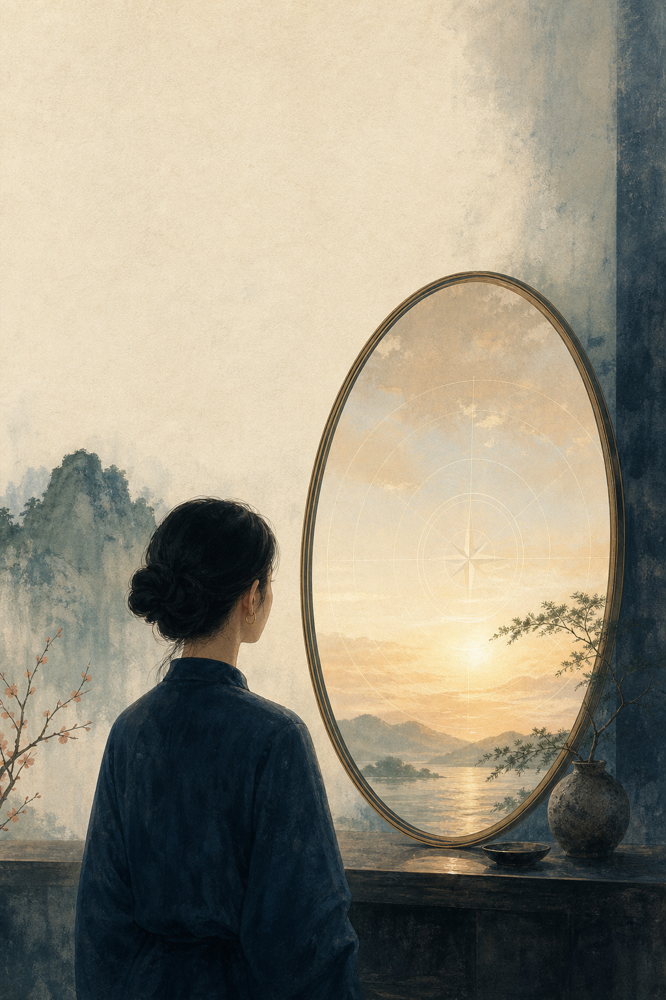

{#fig-cover width=78%}

# 向上而不自困

## 积极斯多葛主义心理学重释医美消费与改善型生活消费

**作者：sooogooo**

> 你可以追求更好，但不必先把自己判定为不够好。

### 出版说明

本书是面向成年消费者的独立写作。它以医疗美容消费为主要案例，延伸讨论其他改善型生活消费。书中“积极斯多葛主义心理学”是作者提出的原创解释框架，并非既有临床流派、诊断工具或治疗方法。

医学、心理健康、法律和监管信息具有边界与时效。本书不能替代合格专业人员的面诊、知情同意、心理健康评估或法律意见。涉及医疗美容服务时，请以现行法律、医疗机构资质和个体化专业判断为准。

### 版本记录

第一版，2026 年。事实审校日期和可追溯参考文献见本书末尾及仓库 `research/` 目录。
