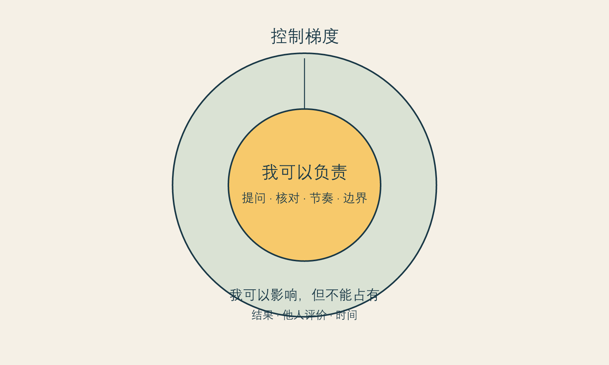

# 当改善成为生存任务

**框架标签：积极斯多葛框架（原创解释框架）**

## 从“我想变好一点”到“我不能再这样”

多数改善愿望起初很轻。有人想让皮肤状态稳定一些，有人希望拍照时不总躲开镜头，有人想在换工作、结束一段关系、进入新的年龄阶段时，给自己一点重新开始的感觉。这样的愿望并不需要接受道德审判。人会整理房间、学习一项技能、调整衣着，也会关注外表。对改善的兴趣不是虚荣的证据。

真正值得警觉的变化，发生在愿望被改写为生存任务的时候。它不再是“我想试试能否改善”，而变成“如果不改善，我就会落后”“如果这一次不做，我就没有资格见人”“如果结果不够明显，就说明我又失败了”。此时，消费不只是消费，身体不只是身体；它们被用来处理价值感、关系焦虑、年龄恐惧和未来的不确定。

这本书不把这种状态叫作“你不够理性”。理性这个词常常被用来羞辱已经很辛苦的人。更准确的说法是：当一个选择被赋予了过多的救赎功能，判断的重量会失衡。项目价格、恢复时间、风险、替代方案和退出空间都会显得不那么重要，因为它们似乎在和一个更大的问题竞争：我到底够不够好。

积极斯多葛框架在这里先做一件不那么激动人心、却很必要的事：把一件被放大到近乎决定人生的事，重新放回它应有的比例。它不是要你降低标准，而是提醒你区分三个不同的句子。

> 我想改善一处外在状态。

> 我希望改善能帮助我过得更自在。

> 只有改善成功，我才值得自在。

前两句可以被讨论、被检验、被安排。第三句则把人的价值绑到了一个不完全可控的结果上。它会让任何不确定都变得像威胁，让任何建议都更容易被听成命令。

## 改善愿望的四种重量

同一个项目，在不同时间对人的意义并不相同。为了避免把动机简单分成“真实”或“虚假”，可以观察它承载了多少重量。

第一种是**使用重量**。它关心的是具体生活：某处困扰是否在真实场景中反复出现，改善是否可能让生活更便利、更舒适或更符合自己的表达。这一层不必被贬低。外表和身体本来就在社会生活中发挥作用。

第二种是**关系重量**。一个人可能希望在亲密关系、职场、社交媒体或家庭评价中少一些被动。问题不在于关系影响了选择，而在于是否能把“我希望更有底气”与“我必须满足某人的标准”分开。关系可以是信息来源，不能自动成为裁判席。

第三种是**时间重量**。生日、婚礼、毕业、升职、分手、疾病恢复、同学聚会，都会让改善看起来特别紧迫。时间节点有时确实重要，但它也容易让人误把“我想在那个日子前感觉好一点”当成“错过这个日子就再也没有机会”。

第四种是**救赎重量**。这是最沉的一层：把一个外在改变想象成对孤独、失败、衰老、被忽视或人生停滞的总解决方案。它不是道德问题，而是范围问题。一项消费很难承受如此多的任务。它也许能带来某种具体变化，却不能保证关系会自动变好、职业会自动上升、过去的伤会自动消失。

救赎重量越大，越需要把决定放慢。不是因为“想得太多”不好，而是因为你正在让一个有限的工具承担无限的职责。

## “可控”不是命令自己冷静

古典斯多葛传统常被简化为一句话：只管你能控制的事。现实中，这句话若被用得粗暴，会变成另一种苛责。身体反应不完全由意志控制，社会审美不完全由个人改变，恢复期也不会因为你足够坚强就失去波动。要求人在这些地方“控制好自己”，反而会增加羞耻。

本书采用的是可控梯度，而不是可控二分。你可以负责的，是是否收集信息、是否明确预算、是否告诉医生自己的真实期待、是否保留第二意见、是否允许自己暂停。你可以影响的，是沟通质量、恢复安排、支持系统、信息来源和触发自己焦虑的内容环境。你不能占有为结果的，是每个人的评价、时间的流逝、身体的全部反应，以及一个改变是否能替你解决所有人生问题。

这三层的意义在于，把“我要变好”从一句无法完成的宣言，变成一组可以负责的行动。它让人从“我必须保证结果”转向“我是否把能做的准备做到了”。前者会制造控制幻觉，后者才会给人真实的行动感。

{#fig-control-circle}

*图 1 可控梯度。图为作者原创，用于说明本书的解释框架，不是医学评估工具。*

## 不把欲望变成罪证

围绕医美最常见的道德争论，往往让人只能在两个位置里选一个：要么承认自己被社会操控，要么证明自己百分之百“悦己”。这两个位置都不够诚实。人的愿望通常不是单一来源。你可以既享受变化，也在意别人的眼光；既有具体困扰，也受到了平台审美的影响；既希望被看见，也不愿意被消费文化定义。

承认复杂，并不会削弱自主。恰恰相反，自主不是证明动机纯净，而是即使动机混杂，也能辨认自己愿意承担什么、不愿承担什么。一个成熟的决定不需要宣称“我完全不受影响”；它只需要不把影响偷偷变成命令。

因此，本书反复使用“检验”而不是“揭穿”。“揭穿”暗示你必然被欺骗；“检验”承认你仍然拥有判断。前者把读者放在被动位置，后者邀请读者成为自己选择的共同作者。

## 一张不要求你坦白一切的卡片

下面的工具不是心理测验，也不会给出“适合”或“不适合”的结论。它只为决定腾出空间。写下答案时，不需要展示给任何人。

### 改善愿望分层卡

1. **具体地说，我想改变什么？**

   不写“变漂亮”，而写一个能被描述的场景：例如“我在视频会议中总想遮住某处”“我想让化妆更省时间”。

2. **如果完全不消费，我希望生活中仍发生什么变化？**

   这个问题不是让你放弃项目，而是防止你把所有期待都交给项目。

3. **如果消费后变化并不如想象，我仍愿意承担哪些代价？**

   写下时间、钱、恢复安排、情绪波动和关系协调，而不只写价格。

4. **谁会因为我的决定高兴，谁会失望？这些反应是否应该替我做决定？**

   把关系重量从内心的雾里拿出来。

5. **我能否把这件事放置两周，再回来看同一组答案？**

   能够等待不等于没有欲望；它表明欲望不必立刻统治行动。

如果写完后仍然想改善，这并不说明卡片失败。如果写完后发现自己更想处理的是睡眠、关系、工作压力或一段长期的自我批评，它也不说明原来的愿望是假的。它只是帮助你把不同的问题放回不同的容器。

## 当一个项目开始替你承担整个人生

改善愿望之所以会变得沉重，常不是因为它本身过分，而是因为它被赋予了太多职责。你希望它让你在拍照时自在、在见客户时更有底气、在亲密关系里少一点警觉、在某个年龄节点不那么慌张。这些愿望可以同时存在。但当它们被压缩成“只要做了这件事，一切就会好”，项目就从选择变成了救赎任务。

救赎任务有一个典型信号：你几乎无法想象“暂时不做”以后还能怎样生活。你不是只担心一个外观问题，而是觉得自己会因此失去机会、被排除在某种生活之外，或再也不能以现在的样子被喜欢。此时，最需要被处理的不一定是项目本身，而是那个被它承接的巨大命题。

可以把一句“我必须改善”拆成三句：

1. 我希望改善的具体体验是什么？
2. 我害怕不改善会失去什么？
3. 这些失去，是否真的只能由这一个选择避免？

第一句帮助愿望具体化；第二句让恐惧有名字；第三句打开替代路径。替代路径不意味着你应该放弃消费，它意味着选择不再被包装成唯一出口。有时替代是更多信息，有时是调整日程、减少镜头、换一种表达方式、让预算留出余地，或和可信的人讨论自己真正担心的部分。

## 不把困难分成“肤浅”与“严重”

很多读者会在两种自我否定之间摇摆：一边觉得自己在意外貌太肤浅，另一边又觉得既然这么痛苦，就一定有一个必须立刻解决的严重问题。两种说法都把复杂经验推向极端。

外貌困扰可以是真实的，不必先通过“足够严重”的考试；它也可以不是疾病、不是道德缺陷，更不自动推出某一个医疗选择。把感受承认下来，才有机会决定它适合被怎样回应。情绪需要被尊重，行动需要被核对。这两件事可以同时成立。

积极斯多葛主义在这里提供的是一种温和的责任排序：我对自己的感受负责，不等于我必须立即满足每一个由感受推动的行动；我愿意改善生活，也不等于我同意把自己的价值抵押给改善结果。前者是行动能力，后者是价值边界。它们合在一起，才不是空泛的“爱自己”。

## 让选择回到一个可以完成的尺度

如果你发现一个问题已经占据许多天，不妨先为它规定一个较小的下一步。不是“我必须决定做不做”，而是“我先用二十分钟写下自己的问题”；不是“我要找到最好的方案”，而是“我先确认哪些问题需要由合格专业人员解释”；不是“我要让所有人认可”，而是“我先确定谁有资格参与这个话题”。

尺度变小，并非把问题看轻。恰恰相反，它是在拒绝让焦虑一次性吞没你的时间、预算和判断。高承诺决定的成熟，不表现为立刻得出最勇敢的结论，而表现为愿意把结论拆成可承担的步骤。

### 一周后的回看

把本章的卡片放一周。期间不要求自己不看镜子、不浏览内容，也不要求自己最后一定改变主意。七天后，只回答四个问题：

- 这个愿望出现得最频繁的场景是什么？
- 我是否把一个外貌问题用来解释了另外的生活困难？
- 我现在比一周前多知道了什么，仍不知道什么？
- 如果暂时不行动，我愿意怎样照料自己的生活？

回看不是冷却掉欲望的技术，而是给欲望一段不必立即表演的时间。

## 本章的证据边界

本章提出“改善愿望的四种重量”和“可控梯度”，属于作者的解释框架和价值立场，而不是对任何个人动机的诊断。关于比较环境可能放大身体意象困扰的研究，可支持我们谨慎对待持续比较；但它不能证明某个具体人为何做出某个具体选择。[推断 I-001；立场 N-001]

下一章将进一步讨论比较。重点不是责怪平台或责怪使用平台的人，而是理解为什么镜子、相机、算法和同龄人的展示，能让一个原本有限的改善愿望突然变得那么急。
