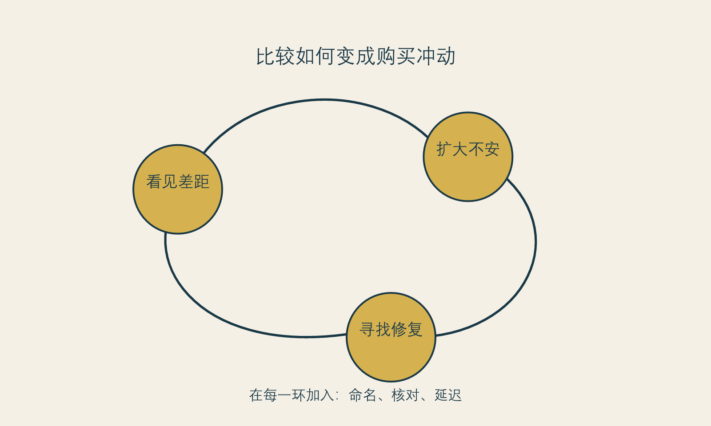

# 镜中的比较机器

**框架标签：积极斯多葛框架（原创解释框架）**

## 镜子没有变，比较的装置变了

过去，人主要在家庭、学校、街道和工作场所里看见别人。今天，比较常常从醒来后第一次打开屏幕就开始：自然光下的皮肤、被修过的鼻梁、恢复期被剪掉的过程、一个月后的对比照、在相似年龄里看似更“成功”的生活。问题不在于屏幕里的每张图都虚假，而在于它们被组织成一种几乎没有停顿的比较环境。

镜子原本只能反射此刻的你。数字镜像同时带来更多东西：别人经过筛选的瞬间、平台推荐的密度、可被放大的局部、可被纠正的实时预览，以及“你本来可以更像谁”的暗示。它把审美从偶尔的社会互动，变成了可以反复点击、反复放大的日常任务。

一项2024年系统综述纳入25项研究、共13,731名参与者，讨论社交媒体、身体意象不满和考虑美容手术之间的关联。作者同时提醒，研究中的平台、样本和方法差异很大，因此不能把这种关联写成简单因果。[事实 F-004；@mironica-2024] 另一项2025年荟萃分析汇总83项研究和55,440名参与者，报告在线社会比较程度与更高身体意象困扰之间存在中等强度关联；这仍然是关联结果，不说明任何一个人的焦虑由平台单独造成。[事实 F-005；@bonfanti-2025]

对读者来说，最有用的结论不是“社交媒体害人”或“你不要看”，而是：比较具有环境性。它会在特定条件下变得更强，例如疲劳、孤独、即将出席重要场合、刚收到外貌评价、刚看到某种前后对比，或者正在被限时优惠追赶。你不必把比较当作人格缺陷；更有效的是识别它什么时候正在接管你的注意力。

## 比较为什么总是显得有理

比较最难处理的地方，是它经常带着证据感。你确实能看见对方皮肤更稳定、轮廓更清晰、镜头感更强；你也确实知道外貌会影响他人的第一印象。于是，大脑很容易把“我注意到了差异”推进为“我必须消除差异”。

这里发生了至少三次跳跃。

第一次，从**差异**跳到**缺陷**。差异是真实的，但它不自动构成需要纠正的问题。一个人照片中的某处更突出，可能来自角度、表情、光线、妆容、滤镜、遗传、生活条件或选择。差异说明你和别人不同，不说明你落后。

第二次，从**缺陷感**跳到**唯一方案**。即使一个人确实对某处长期不满意，解决路径也不必自动收窄为某个医疗项目。信息、造型、休息、关系支持、心理支持、等待，甚至什么都不做，都是可以被讨论的路径。不同路径的成本和意义不同，不存在一个适合所有人的标准答案。

第三次，从**一次选择**跳到**永久身份**。当一个人说“我就是不如她”“我这种脸不配这样穿”，她已经不在讨论一个具体改变，而是在给自己写一条固定的身份判决。积极斯多葛框架不要求你强行喜欢每一处外表；它只拒绝让一处外表拥有解释整个人生价值的权力。

2009年的一项荟萃分析也发现，社会比较与身体不满意相关，并指出这种关联在一些人群中更强。[事实 F-006；@myers-crowther-2009] 这类研究无法告诉我们哪一次刷屏会导致哪一次消费，却足以提醒我们：在高比较状态下做重大、不可逆或代价高的决定，应当比平时多保留一点时间。

## 不要把“真实”与“修过”当作唯一问题

讨论滤镜时，人们常陷入一个很窄的真假辩论：图片修过就是欺骗，没修过就是真实。对消费者而言，更关键的问题是展示的**可比性**。

一张图即使没有后期处理，也可能不适合作为决策依据：它也许只呈现了最有利的角度，也许省略了恢复过程，也许没有说明拍摄设备、妆发、光线、时间跨度和个体差异。反过来，一张经过创作的图片也不一定毫无价值，它可以提供审美灵感。问题在于，灵感不能承担医疗承诺。

当平台内容从“我喜欢这种风格”滑向“我需要复制这个结果”，比较就开始变得昂贵。昂贵不只是指钱，还包括把注意力从自己的生活抽走。你开始在每一个镜面、摄像头和聊天窗口中监控自己，仿佛别人都拿着一把同样严格的尺子。实际上，多数人并没有持续审查你；但持续比较会让这种审查在心里变得真实。

2025年的系统综述指出，高视觉性、重外貌的社交媒体使用与自我客体化和身体意象困扰有关，同时也强调相关研究数量和整合模型仍有限。[事实 F-013；@sarda-2025] 这句话的重点不在于制造新的恐惧，而在于给读者一个更诚实的提醒：如果某种内容让你开始只从外部视角打量自己，减少接触不是逃避，而是调整信息环境。

{#fig-improvement-loop}

*图 2 改善循环。图为作者原创，用于识别决策压力的可能循环，不描述诊断或因果链。*

## 让比较恢复成信息，而不是命令

比较并不一定有害。它可以提供信息：你喜欢什么风格，什么状态让你感到有精神，什么表达方式与你的生活不相称。问题在于信息何时变成命令。下面四个转换动作，可以把比较从命令改回信息。

**把对象从“别人”换成“场景”。** 与其问“她为什么比我好看”，不如问“我在什么场景里感到最不自在”。前一个问题没有终点，后一个问题可能带来具体而有限的答案。

**把时间从“现在”拉回“重复”。** 一次冲动通常在几个小时内很大。把同一个愿望放到两个不同状态里再看：休息后、工作日后、与朋友见面后、离开平台一周后。重复出现的困扰不一定需要消费，但比一次刷屏后的冲动更值得认真对待。

**把视觉从“局部”放回“整体”。** 平台擅长把脸拆成部位，把身体拆成参数。生活不是这样发生的。你在关系、工作、运动、表达和休息中的感受，比一张放大的局部图更接近你的真实生活。

**把行动从“立刻改变”换成“先减少触发”。** 退出一个不断推送前后对比的账号、在情绪低落时不刷相关内容、给购物车加一段等待期，都不是软弱。它们是在保护决定的时间质量。

### 比较暂停协议

当你发现自己在十五分钟内连续查看同类内容、反复放大自己的局部、立刻搜索项目价格或强烈想预约时，可以做一次简短暂停：

1. 关闭相关页面，不在同一晚继续检索项目。
2. 写下触发点：哪一张图、哪一句评论、哪一个场合让你开始不安。
3. 写下一个非外貌的需要：休息、被理解、准备一场活动、获得掌控感，或只是暂时离开比较。
4. 48 小时内不支付订金、不签约、不做不可逆承诺。
5. 两天后重新问：我仍想改善的到底是什么？我是否能说出至少两个非消费的替代路径？

这个协议不是为了把每个愿望拖到消失。它是为了让愿望经过一个不被算法、疲劳和紧迫感占领的时刻。如果它仍然存在，它会以更清楚的形态回来。

## 比较不仅发生在“看别人更好”的时候

比较常被想象成一个简单的上下判断：她比我好，我不如她。但在数字环境中，它更像是一套连续的编辑流程。你看见的不是另一个人的完整生活，而是一个被选择过的表情、光线、角度、恢复阶段、消费路径和情绪结论。即使内容没有修图，它也可能经过时间与叙事的修剪。人会自然拿自己最没有准备的一刻，去对照别人最适合被展示的一刻。

因此，比较带来的痛苦不必说明你嫉妒、脆弱或不够自信。它可能只是说明你在一个不断提供可比画面的环境中，暂时失去了比例感。研究长期发现社会比较与身体不满意存在关联；较新的线上环境研究也提示，外貌相关的比较与身体意象困扰之间存在中等强度相关。[事实 F-005；@bonfanti-2025] 这类关联不能证明任何一条内容导致某个人做出选择，但足以支持一个谨慎结论：比较环境本身值得被纳入消费决策的背景。

## 比较的四种伪装

第一种伪装是“我只是做功课”。做功课当然必要，但当搜集信息逐渐变成反复寻找更糟照片、更极端案例或更绝对答案，它就不再增加判断，而是在增加唤起。

第二种伪装是“我只是追求审美”。审美偏好没有错，但若每一次欣赏都立刻变成对自己的扣分，审美便被改造成了一种惩罚机制。

第三种伪装是“我只是想更有竞争力”。外貌在真实社会中确会影响被看见的方式。问题在于，竞争力从来不只由外貌决定；把复杂的职业与关系处境全部压成某个部位的优劣，会让你失去处理其他条件的能力。

第四种伪装是“我只是怕错过”。这常把他人的选择当成自己的倒计时。别人完成、推荐或展示了一种路径，并不能替你确定它的时点、成本和代价。

识别伪装的意义，不是要你放弃所有内容，而是让你能问：我现在是在获取信息，还是在给一个不安继续供电？

## 设计一个比较卫生环境

“少刷一点”很难执行，因为它没有说明替代什么。更可行的是设计一个比较卫生环境：把持续触发外貌评分的内容与真正需要的信息分开。

- 为咨询和研究设固定的时间段，而不是在疲惫或睡前无边界地搜索；
- 把强烈的前后对比内容先收藏，不在第一遍观看时做决定；
- 对同一问题优先阅读不同来源的完整说明，而不是连续观看同一类高唤起短内容；
- 有意识地保留不以外貌为中心的内容与关系，让注意力不被单一标准垄断；
- 在看完后做一件能回到身体与生活的事，例如走路、吃饭、完成一个工作步骤或联系朋友。

这不是“戒断比较”的道德要求，也不承诺这样做就不会再焦虑。它的作用是降低比较直接接管行动的概率，让你有机会分辨自己真正的偏好。

## 从分数到描述

当你想说“我不好看”“我老了”“我输给她了”，试着改成更接近经验的描述：“我在这个光线里不喜欢自己的某一处”“我担心下周活动的照片”“我看完这些内容后开始想做一个选择”。描述比评分更慢，却更有用。评分直接指向自我价值；描述保留了场景、感受与可讨论的条件。

你不需要说服自己所有地方都美。你只需拒绝让一张照片、一条算法推荐或一个陌生人的叙事，直接充当你价值的计分器。

## 本章的证据边界

社交媒体、在线比较和身体意象困扰之间的研究多数是关联性证据，样本和平台差异显著。它们支持我们把比较环境纳入决策考量，却不能说明任何个人的医美选择由平台导致，也不能证明离开平台就会解决身体意象困扰。[事实 F-004、F-005、F-006、F-013]

下一章谈时间焦虑。比较让人觉得“别人已经在前面”，时间焦虑则让人觉得“我已经来不及”。两者相遇时，最容易产生过早购买。
