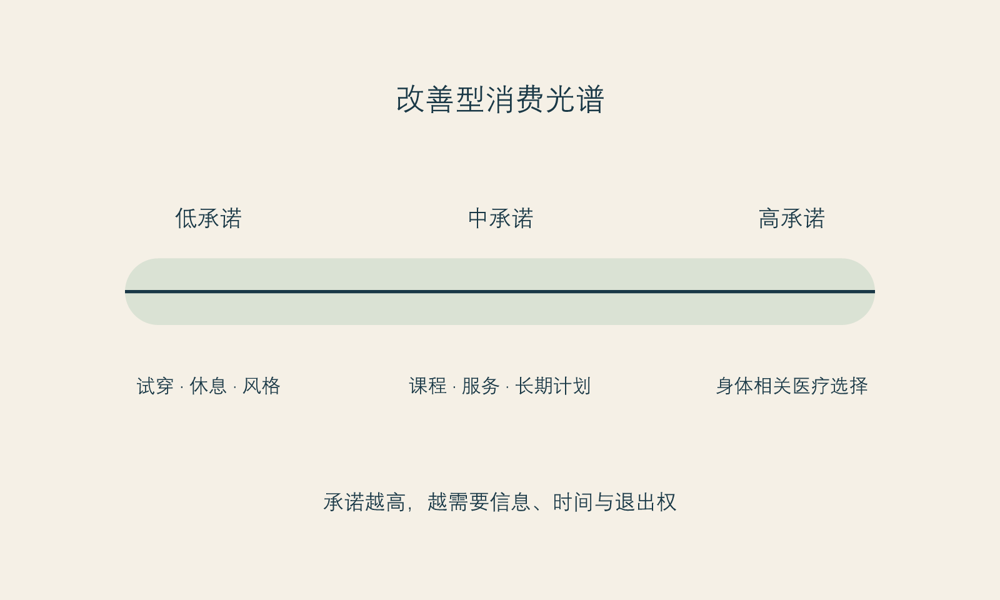

# 时间焦虑与过早购买

**框架标签：积极斯多葛框架（原创解释框架）**

## “再不做就晚了”到底在说什么

年龄、时间和身体变化，是改善消费里最容易被放大的三件事。它们有真实的一面：身体会变化，某些恢复安排确实需要窗口，重大活动也确实有日期。但当“时间有限”被翻译成“现在不买就永远错过”，它就从事实变成了催促。

时间焦虑的力量在于，它很少直接说“你不够好”。它说得更像常识：“趁年轻”“越早越划算”“现在做最自然”“不要等问题严重了再处理”。这些句子之所以有效，是因为它们混合了三种不同的时间：生理时间、社会时间和商业时间。

生理时间指身体的变化和恢复节律，它需要由合格专业人员结合具体情况判断。社会时间指婚礼、求职、毕业、生日、同学聚会、分手后第一次公开露面等人生节点。商业时间则是活动期限、套餐倒计时、名额、价格调整和平台热度。三种时间经常被放在一句话里，仿佛它们都证明了同一个结论：现在必须下单。

积极斯多葛框架的第一步，是把它们拆开。生理时间可以咨询专业人员；社会时间可以重新安排表达方式；商业时间通常只是在告诉你一个促销规则。它们不应自动汇合成对你价值的倒计时。

## 过早购买不是幼稚，而是时间被压缩

“过早购买”不是指任何年轻时的消费，也不是说人必须等到完全确定才行动。它指的是：决定的速度快于信息、价值和代价被理解的速度。一个人可能成年很久、经验丰富、收入稳定，仍然会在强压力时做出过早购买。因为问题不在智力，而在时间被压缩。

时间压缩常见于四种场景。

第一种是**节点压缩**。婚礼、毕业、面试或旅行临近时，改变看起来像唯一能让自己重新掌控局面的事。可一项需要恢复期的选择，未必能在节点前提供你想要的稳定感。把“我希望那天状态好”翻译成“我需要立刻做项目”，中间少了许多应被讨论的环节。

第二种是**比较压缩**。看到同龄人或同行的变化后，人会产生一种被时间抛下的错觉。可你看到的是别人的展示时间，不是他们完整的生活时间。对方可能准备了很久，也可能正在承受你看不见的代价。比较给出的往往不是时间表，而是焦虑感。

第三种是**促销压缩**。限时、最后名额、内部价、专家档期、今天签约送项目，都会把考虑期描述成损失。真正的专业服务不会因为你需要几天核对信息就失去全部价值。若一项选择只能在你来不及思考时成立，它本身就值得被多问几句。

第四种是**情绪压缩**。情绪低落、关系冲突、工作受挫或身体状态不佳时，人特别渴望看到一个可立即执行的改善方案。行动感很珍贵，但行动感不等于行动本身正确。此时最需要的也许是睡一觉、找人谈谈、完成一件小事、离开持续比较的内容，而不是把不舒服快速转换成消费承诺。

## 时间不是敌人，也不是销售员

医美和其他改善消费常常围绕“对抗时间”叙述。可是时间并不只带走东西。它也带来经验、信息、关系的稳定度和对自己更准确的认识。年轻时的某个愿望，几年后仍然存在，可能说明它有长期意义；几年后消失，也不代表当时的你愚蠢，只说明它曾经属于一个特定阶段。

因此，本书不主张“越晚越好”。有些决定确实需要在合适的条件下进行，有些人也会在充分了解后选择较早行动。它主张的是：不要让外部时间替代内部时间。内部时间是你理解自己需要多久、收集信息需要多久、和重要关系沟通需要多久、为恢复期安排生活需要多久，以及即使不做也能继续生活多久。

当外部时间过于急促，内部时间就容易消失。你会把“我要考虑”误听成“我在拖延”，把“我想再查证”误听成“我错过机会”，把“我暂时不做”误听成“我承认自己不够好”。这种误译让每个选择都带着无谓的羞耻。

{#fig-consumption-spectrum}

*图 3 改善消费光谱。图为作者原创。它不替代对任何医疗项目的风险评估。*

## 用“可逆性”重新读时间

比起问“该不该马上做”，更有用的问题是“这个决定的可逆性如何”。可逆性不是单纯的医学概念，也包含财务、生活和心理层面的退出难度。

一个决定越难逆转，越需要更长的考虑期和更完整的信息；一个决定越涉及身体、长期支出、恢复安排和关系协调，越不适合在强促销、强比较或情绪失衡时完成。这个原则不告诉你做什么，它只告诉你：代价越重，越应该把决定从即时情绪里拿出来。

可以把选择粗略地放在一个光谱上：

- 低承诺、可停止、信息成本较低的尝试；
- 需要预约、支出和短期安排的选择；
- 需要较长恢复期、可能影响工作或照护责任的选择；
- 高费用、高不确定性、难以撤回或容易引发连续追加的选择。

光谱的价值不在于替你排出优劣，而在于让考虑时间与决定重量匹配。把高承诺决定放慢，并不是保守；它是对未来自己的尊重。

### 延迟决定日历

当你感到“必须现在决定”时，试着给自己做一张日历，而不是立刻做一个结论。

**第 0 天：记录。** 写下触发事件、想做的改变、促销或节点、已知价格和未知信息。不要在记录当日付款。

**第 2 天：去除一个噪音源。** 暂停查看相关短视频、对比照或群聊；看一看愿望是否仍然一样。

**第 7 天：补一个信息缺口。** 找到一项你尚未理解的事实：资质、恢复安排、替代方案、总成本或第二意见。若你无法获得清楚回答，记录这一点。

**第 14 天：重读。** 用一句话分别写下：我想得到什么？我能承担什么？如果不做，我还可以如何照顾自己？

这张日历不保证你会做出某种“正确”决定。它只确保你的决定不是在最窄的时间缝隙里被挤出来的。

## 对“早”的重新定义

真正值得提早做的，往往不是某个项目，而是准备：建立可信信息来源、了解自己的预算、学习在面诊中提问、把恢复期的照护安排说清楚、和重要的人讨论边界、发现自己开始把一次外在变化想象成全部人生的转机。

这些准备不会让你显得落后，反而让你在机会到来时不必仓促。它们也是可控梯度中最有力量的部分：你无法冻结时间，却可以不让焦虑抢走你的考虑时间。

## 把“窗口期”还给证据，而不是焦虑

“窗口期”是一个强有力的词。它把时间变成门：门开着时你有机会，门一关你就错过。某些医疗问题确实需要由合格专业人员根据具体情况解释时机；但在改善型消费里，窗口期也常被泛化成一种情绪语言，用来把本应允许思考的选择压缩成马上付款。

读者可以把所有“越早越好”的说法分成三类。第一类是需要医学证据和个体评估的问题，不能由广告或本书代替回答。第二类是价格、排期、活动等商业窗口，它们是真实条件，但不等于身体或人生窗口。第三类是情绪窗口：你正处在被比较、被评价、准备见人或害怕变老的高唤起时刻。第三类最容易被误当作第一类。

把它们区分开，能让时间回到正确的责任主体。医学问题问专业人员；商业条件可以计算；情绪窗口则需要先经过冷却。任何一个把三者混成“现在不做就没救”的表达，都值得暂停。

## 未来的自己不是今天的销售员

时间焦虑还有一个更隐蔽的来源：我们会替未来的自己预先判决。你想象三年后的脸、十年后的状态、未来的伴侣、未来的职场，然后把今天的消费当成替未来缴纳入场费。可是未来的你并不是今天的销售员。她可能拥有不同的收入、关系、审美、健康状态和生活优先级，也可能完全不再把今天在意的事情放在中心。

为未来做准备没有问题，问题是把准备改造成对未来的控制。积极斯多葛主义的时间观不是“不要计划”，而是“计划要为未来保留选择，而不是替未来锁死选择”。你可以规划预算、咨询信息、安排照护；但不必因为无法承诺未来全部的自己，就仓促做出不可逆或高承诺决定。

## 一个三时间点练习

当你感到“必须现在做”时，分别以今天、三个月后和两年后的自己写一句话。

| 时间点 | 可以问的问题 |
| --- | --- |
| 今天 | 我最急着摆脱的是什么感受？ |
| 三个月后 | 这个决定会占用我的日程、预算和关系什么位置？ |
| 两年后 | 我希望自己保留什么能力、支持和选择余地？ |

三份答案不必一致。恰恰是这种不一致，提醒你别让今天最强烈的声音独占投票权。如果一个决定经过三次阅读仍显得合理，它可能更接近你的长期偏好；如果它只在情绪高峰显得无可替代，就值得再等。

## “晚一点”也可以是照料

很多消费叙事把等待说成拖延、错失或不够爱自己。可在高承诺选择中，等待常常是最现实的照料：等待预算更稳、支持更到位、信息更完整、日程更有余地，或等待一个不必靠倒计时证明决心的时刻。它不是对愿望的背叛，而是拒绝让愿望损害未来的生活条件。

你不必以“永远不做”来证明自己理性。你也不必以“马上做”来证明自己勇敢。对许多选择而言，能够说“我还没有足够条件”本身就是一种成熟的行动。

## 本章的证据边界

“时间压缩”“过早购买”和“可逆性光谱”是作者为改善型消费提出的解释工具，不是经过验证的临床模型。它们不说明任何人应该等待多久，也不替代对个体医疗风险、恢复期和适应证的专业判断。[立场 N-002]

下一章回到动机。时间焦虑常把愿望推得很急，而动机的复杂性又常让人羞于承认：我也许既想为自己改变，也在意别人怎么看。这不需要被审判。
