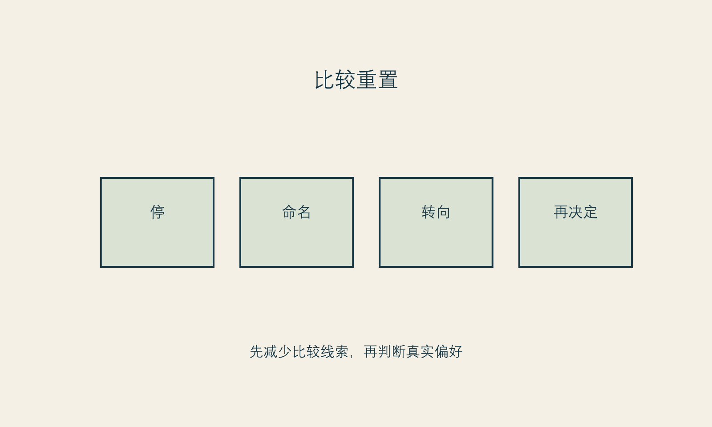

# 动机不是罪证

**框架标签：积极斯多葛框架（原创解释框架）**

## 不必为“想变好看”写辩护词

很多人在考虑医美时，先开始审问自己：“我是不是太在意外表？”“我是不是不够自信？”“如果我真的爱自己，为什么还想改变？”这些问题看起来很有反思性，实际上常常把人推回一个不必要的二选一：要么你完全接受自己，要么你就是被社会操控。

这两种说法都低估了人的复杂性。自我接纳不是停止选择；改善愿望也不是自我厌弃的铁证。你可以喜欢现在的自己，同时希望某一处更符合自己的审美。你可以受他人评价影响，同时仍然保有自己的判断。你可以做出消费，也可以在消费之前、之中和之后维护自己的边界。

动机真正需要被检验的，不是它是否纯洁，而是它是否被夸大、挟持或误置。所谓误置，是指你用一个外在结果去承担本来应由别的资源处理的问题：用一次变化解决长期孤独，用一个项目消除职业不确定，用他人的夸奖弥补关系里的忽视，用“变得更好看”替代对疲惫和失控感的照顾。

这并不意味着项目一定不该做。它意味着你需要让不同的问题拥有不同的答案。一个具体改善可以仍然是选择；但它不必承担救赎职责。

## 混杂动机比“真动机”更真实

我们习惯寻找“真正的动机”，仿佛只要挖到最底层，就能给选择盖章。可人在现实中很少只有一种理由。有人希望减少一个持续困扰自己的外貌细节，也希望在工作场合更自在；有人希望拍照更自然，也在意伴侣是否会觉得自己有吸引力；有人愿意为了长期审美做准备，也会被短视频里同龄人的状态刺激。

混杂动机并不自动降低选择质量。真正降低质量的，是你不能承认混杂，于是只留下一个最好听的理由。例如，你明明很害怕失去年轻感，却只能对自己说“我完全是为了悦己”；你明明被销售人员的焦虑话术压得很紧，却只能说“我早就想做”。当动机被包装得太干净，压力就更难被看见。

积极斯多葛框架并不要求你找出唯一的内心真相。它要求你对自己的理由保持一种温和的诚实：哪些理由来自我愿意承担的偏好，哪些理由来自我不愿继续忍受的外部压力，哪些理由只是此刻很想逃开的不舒服。只有这样，选择才不会被最强烈的情绪偷偷接管。

## 四种常被误认的需要

### 需要被看见，不等于需要被改造

有时，外貌困扰背后是“我想被看见”。这可能发生在关系中被忽略、工作里缺乏肯定、照护他人很久却很少照顾自己之后。外在改变可能带来仪式感和行动感，但被看见的需要还包含被倾听、被尊重、被认真对待。若所有希望都压在脸上，脸就会变成一份无法完成的简历。

### 需要掌控，不等于需要把身体变成项目

工作、家庭、经济、健康或关系的不确定，会让人渴望找到一个能立即做主的领域。身体看似最接近“我可以控制”的对象，于是改善行动会带来短暂的掌控感。可是，身体不是一个完全听命的项目。医疗过程、恢复、别人反应和时间本身都会提醒我们：掌控最可靠的部分，不是保证结果，而是安排准备、信息、预算和支持。

### 需要更新，不等于需要否定过去

人在转换阶段想改变形象很常见。新工作、新城市、结束关系、成为父母、经历疾病或进入新的年龄段，都可能让旧的自我呈现显得不合身。更新可以是很有生命力的愿望。但如果更新被写成“过去的我不值得存在”，它就会变成持续追赶。成熟的更新不是抹掉旧我，而是在新的阶段选择新的表达。

### 需要舒缓，不等于需要立刻付费

焦虑最擅长制造一种错觉：只要我现在做点什么，我就会好起来。行动确实能缓解无力感，但消费不是唯一行动。睡眠、暂停比较、完成一个小任务、跟可信的人说出不安、把信息整理出来，都能让人从被追赶的状态回到可以选择的状态。

这些区分不是要把人从医美或消费中劝走。它们只是防止一种代替关系：把本应由关系、休息、沟通、心理支持或职业行动承担的需求，全部转交给一个消费决定。

{#fig-comparison-reset}

*图 4 比较重置。图为作者原创，帮助读者梳理触发因素；不用于诊断心理状态。*

## “我想变好看”可以继续往下问

愿望不需要被否认，但可以被具体化。具体化不是降低愿望的尊严，而是让它可以和现实相遇。

如果你说“我想变好看”，试着沿着四个方向补全它。

**场景：** 在什么时刻最强烈？是镜头前、社交场合、工作中、亲密关系里，还是独处时？场景帮助你区分持续困扰与环境触发。

**对象：** 我想改善的是具体的外貌体验，还是一种更宽泛的“我不够好”？具体对象可以被讨论；宽泛否定需要更慢地处理。

**代价：** 除了钱，我准备付出什么？时间、休假、恢复期、对家人的说明、对结果不确定性的承受，这些都属于代价。

**替代：** 如果今天不做，我还可以做什么？替代不是反对项目，而是避免项目垄断答案。一个没有替代路径的选择，容易被误认成命运。

### 四问动机表

请用完整句子回答，而不是给自己打分。

1. **我希望改善后，哪一个具体生活场景会变得不同？**
2. **如果别人完全不知道这件事，我还愿意做吗？如果愿意，原因是什么；如果不愿意，原因又是什么？**
3. **我是否希望它替我解决一个并非外貌本身的问题？那个问题还有什么别的处理方式？**
4. **即使最终不做，我想保留的价值是什么？自在、表达、照顾自己、减少痛苦，还是不再被催促？**

回答这些问题，不会产生一份客观正确的动机报告。它更像一次整理：把愿望从一句模糊的总命令，拆成可以选择、可以等待、也可以重新安排的部分。

## 当动机需要专业支持

本书不会判断任何人是否存在心理障碍。但有些状态不适合只靠消费决策工具处理：比如外貌困扰已经显著影响工作、学习、关系或基本生活；反复检查、反复比较或反复求证让人难以停止；对某个微小缺陷的痛苦远超过实际处境；或你感到绝望、想伤害自己。此时，暂停一切高承诺消费，寻求合格的心理健康和医疗支持，比急着找下一个项目更重要。

这不是把“想变美”病理化。相反，它是在保护读者不被任何一本书、任何一张量表、任何一个咨询师或销售人员草率定义。专业支持的意义，不是替你宣布答案，而是帮助你把难以独自承受的痛苦放到更合适的照护关系里。

## 不要把动机审讯成一张通行证

人们常常寻找“足够正确”的动机：如果我只是为了自己，那就可以；如果有一点在意别人眼光，就显得不够纯粹。这个标准并不符合真实生活。人的动机本来就是混合的。你既可能喜欢一种风格，也在意职场场景；既希望更自在，也害怕被比较；既有自己的愿望，也受到亲密关系与文化标准影响。

复杂不等于虚假。更重要的问题不是“我的动机是否一尘不染”，而是“这组动机是否允许我自主地停、问、改主意”。如果动机里含有恐惧，并不自动说明选择错误；如果恐惧已经让你没有退出权、没有预算边界、没有时间核对，它就需要被认真对待。

把动机当成审讯对象，还有一个代价：它会让读者以为必须先彻底弄懂自己，才配行动。实际上，大多数人不会获得一份完整的内心报告。更成熟的做法是承认“我还不完全确定”，并把不确定转化成行动设计：多问一次、少承诺一点、找第二意见、留一个冷却期。行动的质量不取决于你能否把动机讲得完美，而取决于你是否给动机留出了被修正的空间。

## 动机与条件必须分开写

一个实用办法是把“我为什么想做”与“我有没有条件做”分开。前者属于偏好、情绪和意义；后者属于信息、健康、预算、日程、支持与退出权。很多痛苦来自把两者混在一起：因为我很想要，所以我应该有条件；因为我暂时没有条件，所以我的愿望一定不正当。

可以写成两张清单。

| 愿望清单 | 条件清单 |
| --- | --- |
| 我希望改变什么体验？ | 我知道哪些限制和未知项？ |
| 我期待的场景是什么？ | 我是否有足够时间与预算？ |
| 我害怕失去什么？ | 我能否不受促销影响地暂停？ |
| 这件事是否让我感到愉悦？ | 我是否有合格沟通与支持路径？ |

两张清单没有谁比较高尚。愿望负责说明你在乎什么，条件负责保护你不会因在乎而失去自己。只有两者一起出现，选择才不必靠自我羞辱维持。

## 把“别人怎么看”变成可讨论的信息

“我在意别人怎么看”常被当成最不可告人的动机。其实，人是社会性动物，被看见、被评价、被归类都会影响我们的感受。否认它不会让影响消失，只会让它变得难以讨论。需要警惕的不是在意本身，而是把他人的目光升级成唯一法庭。

问自己：我具体在意的是谁？他们的意见会持续影响我的现实生活，还是只是被我想象成一个抽象的“大家”？我希望得到的是赞美、免于嘲笑、专业感、关系安全，还是一种终于可以放松的许可？答案不同，回应也不同。可能需要的是沟通边界、休息、职业支持、风格探索，或者才是进一步了解某项医疗选择。

让“别人怎么看”从一个巨大而模糊的阴影，变成几个可命名的人与场景，能减少它对消费决定的支配。

## 本章的证据边界

本章关于动机、更新、被看见和掌控感的分类，是作者的解释性写作，不是对读者心理历史的判断。[立场 N-001] 关于减少比较线索后再决定的建议，是从比较与身体意象关联的研究中提出的有限推断，不保证对每个人都有同样效果。[推断 I-001]

下一部开始讨论本书的斯多葛式重述：不把所有事情叫作可控，也不因为有不确定就放弃行动。
