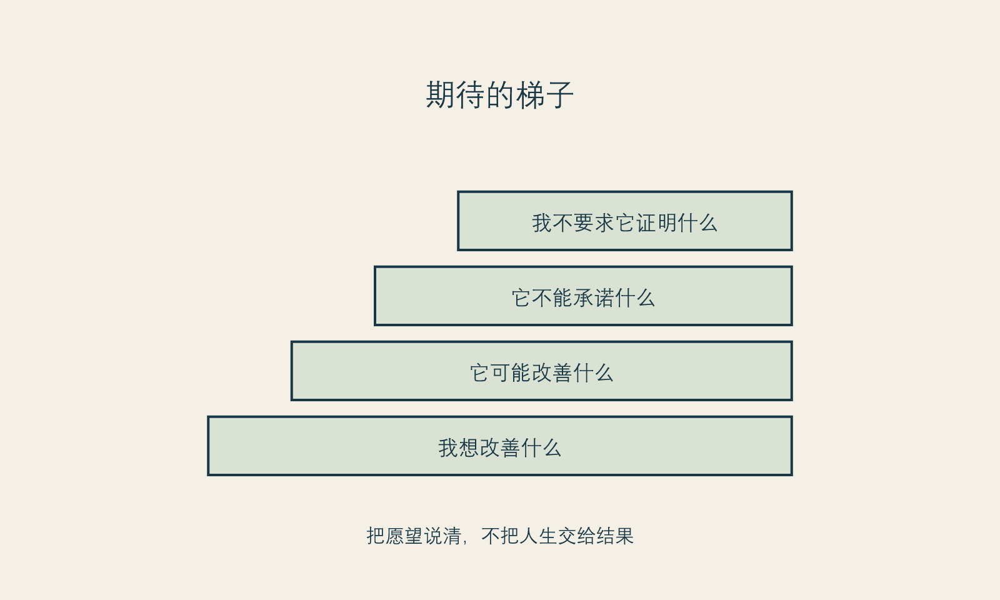

# 不把结果占为己有

**框架标签：积极斯多葛框架（原创解释框架）**

## 期待不是问题，期待的所有权才是

人很难在不期待的情况下做一件改善型消费。你付出金钱、时间、恢复安排和注意力，当然会希望有一个值得的结果。让读者“不要期待”，既不诚实，也不尊重。真正需要讨论的，不是有没有期待，而是你如何对待期待。

有些期待属于愿望：我希望自己照镜子时更自在，我希望穿某种衣服时少一些顾虑，我希望在镜头前不总想着躲开。这些期待可以被说出来，也值得在面诊或准备中被认真对待。有些期待却被写成了合同外的保证：我必须因此更自信、必须让关系变好、必须让别人停止评价、必须把年龄带来的焦虑彻底消除。它们把一个具体结果扩张为人生总结果。

积极斯多葛框架称这种扩张为“占有结果”：你不仅希望某件事发生，还把它当作自己必须兑现、也必须永久拥有的东西。结果一旦出现偏差，你就不只感到失望，还会感到自己被否定。于是，任何正常的恢复波动、任何他人的沉默、任何照片里的不满意，都可能成为“还不够”的证据。

不把结果占为己有，不是把期待降到零；而是把期待改写成可以承受不确定的句子。比如，不说“我做完后必须变得自信”，而说“我希望这项选择能在某个具体场景中减少我的负担；若它不能，我仍会寻找其他方式照顾自己”。后一句不那么戏剧化，却更接近成熟的承诺。

## 把期望拆成四个层级

### 外观期望

这一级最直观：你希望一个部位、线条、状态或整体呈现有什么变化。外观期望需要尽可能具体，也需要由有资质的专业人员讨论可行性、限制和不确定性。它不应只停留在“自然”“高级”“显年轻”这些听起来明确、实际却可能含义不同的词。

### 体验期望

人常常更在意体验：我希望被认真倾听、希望不被羞辱、希望恢复期不会完全失去生活节奏、希望面对镜子时少一点紧张。体验期望同样重要，却更容易在讨论项目时被遗漏。它提醒你，选择的不只是一个结果，还包括一个服务过程和一段恢复生活。

### 关系期望

有些人期待伴侣更肯定、同事更认可、家人少说几句、朋友羡慕，或只是希望不再因为外表感到被动。这些期待不丢人，但必须从项目结果中拆出来。任何人都无法保证他人的反应；把他人的反应当作项目成功标准，会把自己交给一套随时变化的外部评分。

### 人生期望

这是最容易被忽略、也最需要谨慎的一层：我期待自己从此更有价值、更容易被爱、更能掌控人生。它们不是外观期望，而是人生叙事。医美或任何改善消费都可能成为叙事中的一个节点，却很难独自完成整段叙事。越是巨大的期待，越需要被放回关系、工作、健康、兴趣和心理支持等更宽的生活结构里。

{#fig-expectation-ladder}

*图 6 期待阶梯。图为作者原创；用于帮助表达期望，不用于评估项目结果。*

## 结果为什么常常比想象更复杂

一项2025年系统综述对高质量证据的结论很谨慎：在部分短期心理社会结局上，研究观察到可能的改善；但整体研究质量有限，长期的心理健康、整体身体意象、生活质量和社会功能结果仍不确定。[事实 F-009；@garbett-2025] 这并不说明美容手术没有价值，也不说明每个人都会失望。它说明一种更成熟的表达方式是必要的：项目效果不能被自动翻译成人生效果。

这种谨慎尤其重要，因为商业叙事很喜欢跳过中间环节。它会把“改变一个外在特征”直接连到“获得自信”“收获爱情”“逆转年龄”“重启人生”。书中不需要用反向恐吓来对抗这种叙事，比如声称“做了也不会快乐”。两种极端都把读者当作可以被口号推动的人。更准确的态度是：有些人会在某些方面感到改善，有些人不会；同一个人也可能在不同时间感受不同。你有权期待，也有责任不把期待伪装成保证。

## 如何和专业人员谈期待

面诊中的“我想自然一点”“我不想显得做过”“我想变得有精神”，都是有效的开场，但不足以作为结束。它们需要被翻译成可沟通的问题，而不是由对方自动补全。

你可以问：

- 我说的“自然”在您看来可能意味着什么？有没有可能与我的理解不同？
- 我在照片和现实中最在意的场景分别是什么？这些差异会影响讨论吗？
- 哪些结果可以讨论，哪些结果无法保证？哪些变化需要时间观察？
- 如果效果与我预期不同，通常需要怎样的评估、等待和沟通？
- 我希望的关系或自信变化，是否超出了这个项目能合理承诺的范围？

最后一个问题看起来尴尬，却能把讨论从“承诺更多”变成“边界更清楚”。一个值得信任的专业沟通，不会因为你问边界而觉得你麻烦。相反，能够解释不确定性、替代方案和不适合之处，是专业性的一部分。

## 不用结果审判过程，也不用过程粉饰结果

“我已经很认真做功课了，所以结果必须好”是一种常见的心理算式。它把努力视为对结果的购买。可努力的价值不在于让结果服从，而在于你能更清楚地决定、沟通和承担。即使结果不完全如愿，认真准备也没有白费：它让你知道发生了什么、该问什么、何时该暂停，以及不要在最不安时被下一次消费接管。

反过来，“过程很努力，所以结果不重要”也不诚实。结果会影响真实感受。允许自己失望、允许提出问题、允许寻求合适的专业评估，都是正当的。积极斯多葛不是让人用哲学粉饰不满意，而是避免在不满意时立刻把自我价值、医生关系和下一次消费绑在一起。

### 期待阶梯练习

写下你对一项改善的所有期待，然后在每一条后面标记：

| 期待 | 属于哪一层 | 我可以做什么 | 我不能要求什么 |
| --- | --- | --- | --- |
| 例如：镜头前更自在 | 体验 | 说明具体场景、准备恢复安排 | 保证所有照片都满意 |
| 例如：伴侣更欣赏我 | 关系 | 沟通自己的需要 | 控制对方反应 |
| 例如：从此不再焦虑 | 人生 | 寻找多种支持 | 让一次消费消除全部焦虑 |

表格不是为了浇灭期待，而是给期待一个更合适的容器。它会让你在选择前少一点神话，在选择后少一点自责。

## 期待不是合同，也不是禁语

有些人因为害怕失望，索性对自己说“不要期待”；另一些人则把一幅理想图像当成选择的隐形合同。两种做法都没有真正处理期待。前者让人失去表达愿望的能力，后者让人难以听见条件与不确定性。

更稳妥的期待，既要有形状，也要有弹性。它应当能说清你在什么场景里希望有什么变化，也能承认它不是对某一种视觉结果、关系反馈或情绪状态的索赔。期待越具体，越容易与专业人员讨论；期待越被当成所有权，越容易在现实出现差异时变成自我否定或冲动修复。

## 结果之外还有过程公平

人们常以为只有结果好，过程才值得。事实上，一次高承诺选择的过程也有独立价值：信息是否充分、问题是否被尊重、是否有足够时间考虑、是否存在可沟通的复核路径、是否把未知项说清楚。即使最终体验复杂，一个被尊重、可复核的过程仍然比被催促、被蒙混的过程更有价值。

这不是用“过程很努力”粉饰任何不理想结果。它是提醒读者，不要把全部评价压缩成最后一张照片。结果需要如实面对；过程也需要如实检验。两者分开，才能知道下一步到底是医学沟通、生活调整，还是需要重新审视自己承受了什么不合理压力。

## 给“自然”这样的词留出解释空间

“自然”“协调”“改善气质”是审美沟通里很常见的词，也是最容易被误以为双方已经理解一致的词。它们实际包含许多可能：有人指他人不易察觉，有人指表情仍然舒适，有人指与生活场景相配，有人只是希望自己看起来没那么疲惫。若不把词拆开，双方即使都说“自然”，也可能在谈不同的事。

在面诊或自我记录里，可以把抽象词改成场景词：我在哪种光线、镜头、社交或工作情境下感到不自在？我希望别人看到什么，或不必看到什么？我担心什么样的变化？我能接受哪些不确定性？场景词无法消除审美差异，却会减少把一个含糊形容词误当作确定承诺的风险。

## 当期待变化时

期待会变，这不是不诚实。你获得更多信息、经历恢复、进入新的生活阶段后，原先的想法可能不再完全适用。允许期待变化，是对自己真实经验的尊重；但期待变化不等于需要立即追加新的选择。先区分：是我对结果有新理解，还是我正在被新的比较和焦虑推着走？我是否已经完成原先约定的沟通与观察？我是否仍有时间和预算余地？

把这些问题放在新增行动之前，可以让结果不再拥有你的全部注意力。你可以关心结果，却不必占有结果；可以更新期待，却不必把每次更新变成一次购买。

## 本章的证据边界

关于美容手术心理社会结局的证据存在程序、人群、研究质量和随访期的局限。本章据此主张谨慎管理期待，但不据此替任何读者判断项目的价值或结果。[事实 F-009] “期待阶梯”是作者的反思工具，而非临床量表。[立场 N-001]

下一章会从自我批评转向自我立法。若结果不应承担全部价值，那么我们需要用什么原则来安排改善，而不是任由羞耻和追赶来安排。
