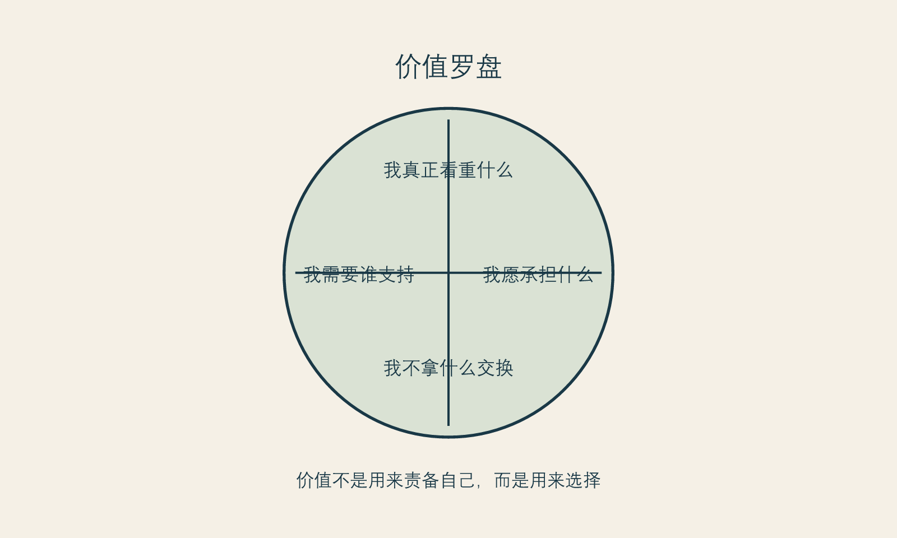

# 从自我批评到自我立法

**框架标签：积极斯多葛框架（原创解释框架）**

## 批评能推动人，却很少能带人走远

许多改善计划从一句尖锐的话开始：“我不能再这样了。”“我看起来太差。”“我怎么连这点自律都没有。”这种批评有时确实会带来行动：预约、购买、节食、训练、换发型、搜索项目。于是人很容易相信，羞耻是有效燃料。

它的问题不在于完全没有效果，而在于它的燃烧方式。羞耻能制造短期紧迫，却很难建立长期关系。它让你把身体当作拖后腿的对象，把休息当作懒惰，把不确定当作失败，把每一次正常的波动当作自我管理失控。最后，改善不再是一种选择，而成为不断证明自己不配停下来的过程。

积极斯多葛框架提出“自我立法”，并不是要你变得更严厉。这里的“立法”是给自己制定可以公开说明、可以长期执行、也允许修订的原则。它与“我必须更完美”不同。完美主义的规则没有完成条件；自我立法的规则有边界、有例外，也承认身体和生活不是永远稳定的系统。

## 什么叫做一条可生活的原则

一条可生活的原则至少包含四个特点。

**它具体。** “我要对自己好”太宽，宽到焦虑来临时无法使用。更具体的说法是：“涉及身体和高费用的决定，我不在当天支付。”“我不接受以羞辱、恐惧或秘密感推动的消费。”“我会在恢复安排不清楚时暂停。”

**它对称。** 你愿意把这条规则用在朋友身上，也愿意用在自己身上。若你不会对朋友说“你不够漂亮所以必须赶紧做”，就不必把这句话留给自己。

**它承认代价。** 原则不是愿望清单。它会写出你愿意为改善付出什么，又不愿付出什么。例如，愿意投入预算和恢复时间，但不愿透支借贷、不愿隐瞒重要风险、不愿在关系威胁下做决定。

**它可以复盘。** 人会变，生活也会变。能被修订的原则比“永远不变”的誓言更可靠。复盘不是反复怀疑自己，而是检查这条规则是否仍然保护了你重视的东西。

## 自我慈悲不是放弃要求

有人听到“不要自我批评”，会担心这让人失去动力。可自我慈悲不是“什么都无所谓”，也不是对问题视而不见。它更接近一种不羞辱的诚实：我可以承认自己不满意、承认需要改变、承认做过不理想的决定，同时不把这些事实升级为“我这个人很差”。

一项2020年系统综述与荟萃分析在饮食和身体意象研究中发现，更高的自我慈悲与较少身体意象困扰有关；作者也同时讨论了样本与干预研究的局限。[事实 F-011；@turk-waller-2020] 这类证据不能直接推导为“只要练习自我慈悲就会解决医美焦虑”，更不能把一个概念变成处方。它的启发是：用羞耻驱动身体管理，并不是唯一的动力模型。

同样，关于接纳与承诺疗法（ACT）用于身体不满意的2025年荟萃分析报告了相对对照组的中等效应量，但研究数量、样本与干预方式仍需要仔细解读。[事实 F-012；@boyle-2025] 本书不教授治疗，也不建议读者自我治疗。它只借用一个与斯多葛框架相容的提醒：行动可以由价值指引，而不必由消除不舒服来指挥。

## 从“我讨厌什么”到“我守护什么”

自我批评习惯从讨厌开始：我讨厌显老、讨厌镜头、讨厌不够瘦、讨厌自己没有坚持。自我立法则换一个问题：在改善时，我想守护什么？

有人会回答：自主。我不希望因为平台热度或他人评价做重大决定。有人会回答：健康。我不希望为了一个审美结果牺牲基本生活节奏。有人会回答：诚实。我不想假装自己完全不在意外表，也不想把不安全部藏起来。有人会回答：尊严。我不接受任何人把我的外表当作谈判筹码。

这些价值不会替你给出项目答案，却会成为筛选答案的标准。一个选择即使看起来很流行、很划算、很快，也可能不符合你要守护的价值。反过来，一个经过充分信息、预算和支持安排的选择，即使别人不理解，也可能仍然符合你的原则。

{#fig-values-compass}

*图 7 价值罗盘。图为作者原创，呈现的是作者立场，不是心理测量结果。*

### 个人改善宪章

请用自己的语言完成以下句子。它不需要漂亮，只需要在压力来临时能用。

1. **我允许自己想改善，因为：** ________。
2. **我不愿意为了改善付出的代价是：** ________。
3. **当我被催促、羞辱或比较时，我的暂停规则是：** ________。
4. **我会如何判断一个选择仍然属于我，而不是属于他人的恐惧：** ________。
5. **如果结果不如预期，我不会立刻做什么：** ________。
6. **我会先向谁求助、补充什么信息、给自己多久时间：** ________。

这不是一份道德承诺书。它可以很小，例如“我不在深夜看完对比图后付款”“我会把总成本写出来”“我有权对任何推销说让我考虑”。小规则之所以重要，是因为真正的自主通常不靠一次宏大宣言，而靠一系列可重复的微小边界。

## 不把原则变成新的完美主义

原则也会被误用。有人写下“我永远不做冲动决定”，然后一旦情绪上头就又责怪自己；有人写下“我必须完全独立”，于是拒绝一切关系影响；有人写下“我只能为自己变美”，于是连被看见、被喜欢的愿望都不允许存在。这样写原则，只是把旧的苛责换了更高级的语言。

可生活的原则允许复杂、允许修订、允许承认：我这次没有做到，但我仍能重新回到我想守护的价值。积极斯多葛不是要你成为情绪永远正确的人，而是要你在情绪来临时不立即交出自己的判断权。

## 原则不是惩罚自己的新话术

很多人从自我批评转向“原则”时，会不小心把原则也变成鞭子：我必须永远冷静、绝不比较、绝不冲动、永远做正确决定。这样写出来的不是原则，而是另一套无法完成的完美主义。它仍然在问“我够不够好”，只不过换了更理性的语言。

一条可生活的原则，应该在你状态最差的时候仍然可以使用。它不要求你没有情绪，而是告诉你情绪来了以后怎样不失去自己。例如：

- 我可以在意外貌，但不在情绪高峰付款；
- 我可以听取建议，但不把决定权交出去；
- 我可以期待变化，但不把尊严押在结果上；
- 我可以改变主意，但先完成一次清楚的复核；
- 我可以需要支持，而不把求助当成失败。

这些句子的重点不在于优雅，而在于可执行。原则应当像一个扶手，而不是一个更高的审判台。

## 自我立法为何需要例外条款

生活并不总按你预设的条件运行。你可能在某个重要活动前突然焦虑，可能遭遇关系中的评价，可能因身体或财务变化而无法遵守原计划。若原则没有例外条款，人就很容易在一次失守后宣布全部失败。

因此，每一条原则后都可以加一句：“如果我暂时做不到，我的补救动作是什么？”例如，原本打算冷却两周却已经被促销打动，可以补救为“今天不付款，只把问题带回家”；原本想少看比较内容却连续刷了一晚，可以补救为“明天把关注列表清理十分钟，并安排一个不围绕外貌的活动”。补救不是找借口，而是承认自我治理的目标是继续生活，不是赢得一次道德考试。

## 从评价到承诺

自我批评关注的是“我怎么又这样”；自我立法关注的是“此刻我愿意守住什么”。两句话的方向不同。前者把注意力拉回过去的失败，后者把注意力放到下一步的承诺。

在改善型消费里，这种转向尤其重要。你不必先判定自己虚荣、冲动或不够自律，才配暂停。暂停可以是为了守住预算、睡眠、关系、身体安全、信息质量与未来的选择余地。当行动有了明确保护对象，它就不再只是对冲动的压制，而是一种对生活的照料。

## 本章的证据边界

自我慈悲、ACT 与身体意象相关研究不能直接外推到每位医美消费者，也不能替代治疗。[事实 F-011；F-012] “自我立法”“价值罗盘”和“个人改善宪章”是本书的作者工具，属于价值判断与实践建议，不是临床干预。[立场 N-001]

下一章讨论延迟。原则需要一个落点；最常见、也最容易被轻视的落点，就是在被催促时给自己留出时间。
