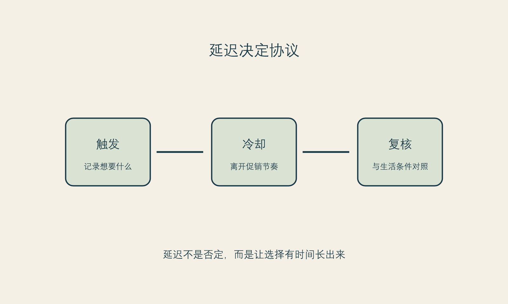

# 延迟是一种能力

**框架标签：积极斯多葛框架（原创解释框架）**

## 决定之前，先拥有一个不被催促的时刻

“再想想”在消费现场常被说成犹豫、拖延或错失机会。可对涉及身体、金钱、恢复期和长期期待的选择而言，延迟不是消极动作。它是一种能力：在情绪、促销、关系压力和信息不完整同时出现时，仍然给自己保留一个可以重新判断的时刻。

延迟之所以难，不是因为人不知道它有用，而是因为许多环境都把它变得昂贵。限时优惠让延迟看起来像损失；朋友已经做了让延迟看起来像落后；销售人员的热情让延迟看起来像不信任；自己的焦虑则让延迟看起来像继续忍受。于是，人会把“我暂时不决定”翻译成“我在对自己不好”。

积极斯多葛框架不同意这种翻译。它认为，能够在压力中保留判断时间，本身就是对自己的照顾。行动不等于立刻签约；行动也可以是收集资料、写下问题、预约第二次沟通、告诉朋友自己需要安静几天，或者干脆离开一个让你无法思考的现场。

## 延迟不是回避

回避是为了不感受、不沟通、不看事实，因而让问题越积越大。延迟则相反：它是为了获得更完整的事实、更清楚的价值和更可承担的代价。两者表面上都可能是“先不做”，内在方向却不同。

你可以用一个很简单的区分来判断：延迟期间，我是否在让决定变得更清楚？如果你在核对资质、计算总成本、安排恢复支持、写下期待和不愿承担的代价，延迟就在发挥作用。如果你只是不断刷同类内容、反复让自己焦虑、又不敢面对任何具体问题，那可能需要换一种支持方式。

延迟也不要求你把情绪压下去。情绪本身是信息：它告诉你这件事对你重要，或者你感到威胁。问题是情绪是否被赋予了最终投票权。你可以承认“我现在很想立刻改变”，同时不在这种状态下做高承诺选择。

## 共享决策给我们的一个启发

一项针对择期手术的系统综述发现，共享决策在所纳入研究中倾向于改善决策质量，并在部分研究中降低决策冲突；它对接受手术比例的总体影响并不明确。[事实 F-010；@wong-2016] 这项证据并非专门针对医美，也不提供某种单一话术。它的关键启发是：好的决策支持不以“让人做或不做”为目标，而以让人更了解、也更符合自己价值为目标。

这正是延迟的价值。延迟不服务于一个预设结论。它不保证你最后会拒绝，也不保证你最后会做。它只提高一个更基本的可能：无论最后怎么选，你能更清楚地说出这是谁的选择、基于什么信息、愿意承担什么、还保留哪些退出权。

## 四种值得设置的“延迟闸门”

### 金钱闸门

当选择涉及订金、分期、套餐或附加项目时，先让数字落到纸上。总成本不只包括标价，还包括可能的复诊、恢复期安排、交通、误工、照护、后续维护和不确定支出。写出来不是为了把所有消费否掉，而是为了让“我能承受”从感觉变成可以检查的事实。

### 信息闸门

如果你还不能清楚说出：项目的目的是什么、哪些是已知限制、哪些问题需要问专业人员、替代路径有哪些，那么决定需要继续停在信息闸门前。信息并不等于无穷搜索；它是足以让你提出好问题、发现关键未知项的最低清楚度。

### 关系闸门

如果一个决定需要隐瞒、害怕被威胁、担心关系报复，或者只为了避免某个人的不满，就不宜匆忙推进。关系并非都要获得批准，但它确实可能影响恢复支持、财务边界和情绪安全。把这些影响说清楚，是保护自主而不是放弃自主。

### 恢复闸门

只要一项选择可能影响工作、照护责任、出行、睡眠、社交或情绪稳定，就应有一个恢复闸门：我准备了什么？谁知道？谁能支持？如果计划变化，我有什么备选？如果这些问题没有答案，项目的价格再好，也不等于时机合适。

## 把“错过”放回它的尺度

促销最擅长把普通机会说成唯一机会。实际上，大多数商业机会会以不同方式再次出现；真正不可替代的，是你在重大决定中保持清醒的能力。即使某个价格、名额或档期确实消失了，也不必因此把自己说成失败。失去一项优惠，不等于失去改善生活的可能。

这种看法不是反商业，也不是假装钱不重要。预算当然重要。但“便宜”不是“适合”的同义词，“现在有名额”也不是“现在有准备”。当一个机会只靠夺走你的考虑时间才显得有价值，它至少应当经得起一次暂停。

{#fig-deferment-protocol}

*图 8 延迟协议。图为作者原创，显示的是决策流程，不是医疗流程。*

### 二十四小时延迟协议

对于任何在现场让你想立刻支付的高承诺选择，先执行这一版简短协议：

1. 明确说出：“我今天不付款，我需要带走资料。”
2. 在离开现场后写下三件事：我听到的承诺、我没听懂的地方、我被触发的情绪。
3. 24 小时内不看促销倒计时，不和同一销售人员反复讨论，不让朋友替你催决定。
4. 第二天只做一项补充行动：核对一个关键事实或预约一次独立咨询。
5. 如果对方拒绝给你时间、拒绝提供可带走的信息，或把你的延迟解释为“不够重视自己”，把这种反应也记入你的决定资料。

## 冷却期需要被设计，而不是被想象

“我再想想”有时没有力量，因为它没有对抗任何具体的催促。信息流仍在推送，优惠仍在倒计时，朋友仍在问，咨询记录仍在制造一种已经走到最后一步的惯性。有效的延迟不是一句意志口号，而是一套环境设计。

你可以先决定冷却期的起点与结束条件。起点可以是第一次咨询、看到强烈内容、拿到报价或感到“今天必须定下来”的那一刻；结束条件不是“我彻底不焦虑”，而是完成几项可验证动作：把问题写成清单、睡过几晚、核对两类信息、看过预算与日程、与支持者讨论自己真正担心的部分。冷却期结束后，你仍然可以选择继续，但继续不再只是对压力的反应。

## 延迟不是把责任推给未来

有人怕拖延，是因为过去曾用“再等等”逃避真正需要解决的问题。这个担心合理。区别在于，逃避让问题越来越模糊，延迟让问题更具体。逃避不设日期、不写问题、不核对条件；延迟有明确的回看时间，并在等待中补齐信息、预算、支持或沟通。

可以给每一次延迟写一个“归来日期”：我会在某日重新阅读记录，并只回答三个问题：我的愿望还在吗？我的条件够了吗？我是否比上次更能承受不确定性？这样，延迟不再是一种无期限搁置，而是一种有方向的决定能力。

## 不把优惠当作事实的一部分

优惠可以是真实的商业条件，但它不应该改变关于适合与否、风险边界、恢复安排和你的长期价值排序的事实。把报价从决策里暂时拿掉，问自己：“若没有这个价格，我是否仍愿意花时间了解？”如果答案是否定的，说明你需要先弄清自己是在选择服务，还是在选择不想错过的感觉。

这不是说任何在优惠期间作出的决定都不理性。它只要求一件事：让优惠不能独自决定你的时间表。你可以计算价格，却不要让价格替你回答身体、生活和关系的问题。

## 一个可执行的二十四小时协议

在无法安排更长冷却期时，至少保留二十四小时。期间不转账、不追加、不因朋友催促改变结论；只做四件事：写下想改善的具体体验、列出三个未知项、把总成本放进自己的账户结构、告诉一位可信的人“我明天再决定”。二十四小时不保证答案完美，但它至少中断了“情绪—付款”的直通车。

如果任何场景让你无法获得这二十四小时，或把等待解释成不珍惜自己，那么问题不只是你够不够果断，而是这个决定环境是否给了你足够的退出权。

## 本章的证据边界

共享决策的系统综述主要来自一般择期手术情境，不能直接证明某种医美流程的效果。[事实 F-010] 本章的四道延迟闸门和二十四小时协议是作者的实践工具，不是法律要求、医疗指南或心理治疗。[立场 N-002]

从下一章开始，框架进入医美这个主案例。医美不能被当作普通商品，不是因为它天然更神圣，而是因为它同时涉及身体、医疗服务、金钱、时间和身份感。
