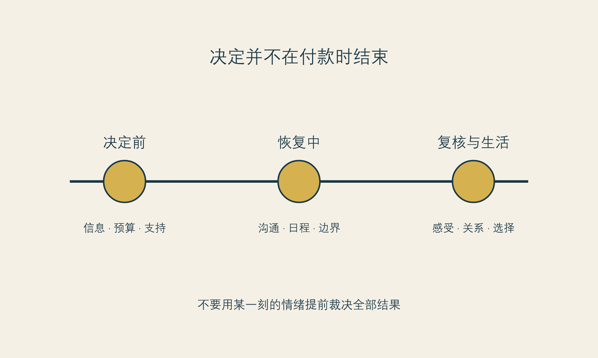

# 医美不是普通商品

**框架标签：积极斯多葛框架（原创解释框架）**

## 它既是消费，也是医疗服务

把医美只当作消费品，会低估它的身体和医疗属性；把它只当作医疗，又会忽略它与审美、营销、关系和身份感之间的联系。它处在一个复杂的位置：人以消费者的身份接触信息、价格、广告和服务体验，又以求美者或患者的身份进入涉及身体的医疗场景。

中国《医疗美容服务管理办法》将医疗美容界定为运用手术、药物、医疗器械以及其他具有创伤性或侵入性的医学技术方法，对容貌和人体各部位形态进行修复与再塑。[事实 F-001；@nhc-medical-aesthetics-2002] 这一定义提醒读者：至少在其适用范围内，医美不是单纯的“买个效果”。它意味着专业资质、信息沟通、风险管理和知情同意都不应被促销语言覆盖。

“医美不是普通商品”并不意味着读者必须对它恐惧，也不意味着所有选择都应被道德化。它只意味着，讨论时不能只问“值不值”“有没有折扣”“别人做得好不好看”。还要问：这项服务对身体意味着什么？我是否理解信息的边界？我是否有足够的恢复支持？我是否被允许充分考虑？如果结果有不确定性，我是否知道应如何沟通和评估？

## 四种成本，不只是一张价格单

医美消费最容易被低估的，是价格之外的成本。它们没有固定数字，却会真实影响一个选择是否适合当下。

### 身体成本

身体成本包括恢复期、可能的不适、需要遵循的专业建议、生活节奏变化，以及个体差异带来的不确定性。本书不对具体程序提供风险判断，因为那需要由合格专业人员结合个体情况说明。读者可以做的，是不把“别人恢复得很快”当作自己的承诺，也不把“项目很常见”翻译成“我无需了解限制”。

### 财务成本

财务成本包括标价，也包括复诊、维护、交通、休假、照护、后续消费和可能的机会成本。它最容易在套餐、分期和“今天更划算”的语言中被压缩。一个尊重自己的预算，不只是问有没有钱付首笔，而是问：若出现额外安排、收入波动或我改变主意，这件事会不会把我逼到没有选择的地方。

### 时间成本

时间成本不是“等几天”那么简单。它包括准备、咨询、恢复、与工作和家庭协调、处理他人询问、等待结果稳定、以及在不确定中保持生活的能力。很多人并不是没有预算，而是没有时间带宽。承认时间带宽不足，不是退缩；它是在判断时机。

### 叙事成本

这是最少被写进报价单的一项。叙事成本指一个选择会怎样进入你对自己的故事：我会不会从此更频繁地检查自己？我会不会把下一次不满意都解释为需要继续修正？我是否因此更能表达自己，还是更难离开外部评价？叙事成本没有统一答案，但不问它，就容易把一次选择放进一个不断追加的故事里。

{#fig-recovery-timeline}

*图 9 恢复时间线。图为作者原创，展示的是消费者准备与支持节点，不替代任何医疗恢复方案。*

## 为什么“效果”不是唯一的评价标准

关于美容手术后的心理社会结局，现有高质量证据仍有限。一项2025年系统综述指出，部分短期结果可能改善，但整体证据质量低，长期的心理健康、整体身体意象、生活质量和社会功能结论仍不确定。[事实 F-009；@garbett-2025] 这提醒我们，项目评价不能只由“前后对比是否明显”组成。

对消费者而言，更完整的评价至少包括：我是否在充分信息下做决定？沟通是否诚实？恢复安排是否被尊重？我是否有机会提出疑问和不满意？我是否把一次外在变化夸大成整个人生的判决？这些问题不替代对结果本身的感受，却可以防止结果成为唯一的裁判。

## 医美消费里的“退出权”

退出权是本书最看重的消费者概念之一。它包括在咨询后不继续、在被催促时离开、在签约前带走资料、在不理解时要求解释、在关系压力下暂停、在恢复期不马上追加。没有退出权的选择，常常只有表面的自主。

退出权并不等于对专业人员不信任。真正专业的服务应当经得起提问、第二意见和考虑期。若一个人只能靠“现在就决定”才能得到被尊重，她得到的不是更强的自主，而是更窄的选择空间。

### 四维成本账本

在考虑一项医美服务前，分别写下：

| 维度 | 我已知的成本 | 我未知的成本 | 我愿意承担的上限 |
| --- | --- | --- | --- |
| 身体 |  |  |  |
| 财务 |  |  |  |
| 时间 |  |  |  |
| 叙事与情绪 |  |  |  |

账本不是为了制造更多恐惧。它的作用是让你看到：一个选择的价值，不只由它看起来能带来什么决定，也由你是否有能力承受它带来的全部生活安排决定。

## 高承诺不等于高价值

医美消费的价格、专业语言和身体介入程度，容易制造一个错觉：承诺越高，选择越高级；花得越多，自己就越认真。这个错觉会让人忽略一个基本事实：高承诺只意味着信息不对称、恢复安排、预算、不可逆性或退出成本可能更高，不意味着它天然更适合、更有效或更能说明一个人重视自己。

把医美从“普通商品”中区分出来，并不是把它神圣化。恰恰相反，是为了防止它被普通商品化的节奏处理：限时下单、直播冲动、朋友拼单、靠展示图直接判断、把追加当成升级。身体相关选择需要更多沟通、更完整的边界和更充足的时间，并非因为读者不够聪明，而是因为它对生活条件的要求更高。

中国现行《医疗美容服务管理办法》将医疗美容界定为运用手术、药物、医疗器械或其他具有创伤性或侵入性的医学技术方法，对容貌和人体各部位形态进行修复与再塑的服务。[事实 F-001；@nhc-medical-aesthetics-2002] 这一定义并不回答某个具体项目是否适合你，但它提醒读者：当选择进入医疗美容的范围，营销语言不能替代相应的专业沟通与合规路径。

## 价格不是总成本

报价通常只呈现最显眼的一部分。真正的总成本还可能包括恢复期对工作与照护的影响、交通、陪伴、因不安而增加的信息搜寻、对隐私的管理，以及最常被忽略的一项：你是否会在结果尚未被充分理解前，被新的不满意推向下一次选择。把这些写进预算，不是悲观，而是防止一个表面可承担的价格变成生活里难以承受的消耗。

本书建议把“能不能付”改成三个问题：我是否能付项目费用？我是否能付恢复和沟通的费用？我是否能在不动用安全缓冲的情况下，承担选择后来临的复杂性？前两问涉及钱，第三问涉及生活余地。三者缺少任何一项，都值得先暂停。

## 从项目名回到问题名

许多决策是从项目名开始的：我听说某个项目很热门，我朋友做了，我在平台看了很多。更可靠的顺序应当相反：先说我在何种场景里遇到了什么困扰、期待什么变化、什么是我不能接受的代价；再让合格专业人员说明有哪些可能路径、限制与未知项。若问题尚无法描述，项目名也不应替你填空。

把项目名放在最后，不是为了拒绝流行信息，而是为了防止“现在流行什么”先决定“我需要什么”。成熟的消费判断从不要求你先成为医学专家，它只要求你保留自己的问题，而不把问题完全交给营销替你命名。

## 本章的证据边界

中国医疗美容服务的定义与监管适用范围应在发布前再次核验；本书不提供法律结论。[事实 F-001] “四维成本”“叙事成本”和“退出权”是作者提出的消费者分析工具。[立场 N-001；N-002] 关于心理社会结局的研究不能替代任何个体的医疗或心理评估。[事实 F-009]

下一章走到面诊桌前。那里不应是一个人被说服的终点，而应是信息、价值和不确定性被说清楚的起点。
