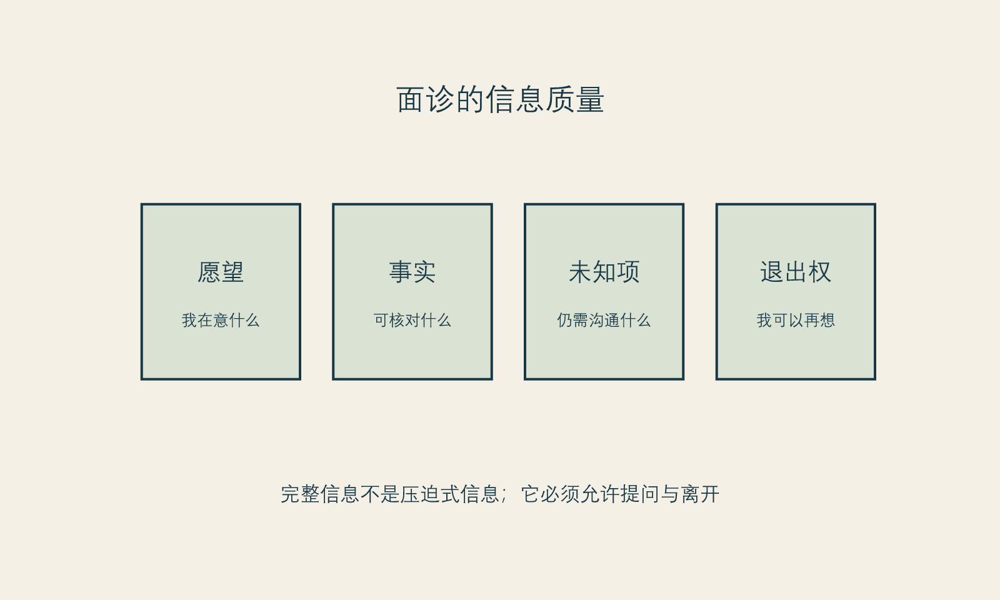

# 面诊桌前的知情空间

**框架标签：积极斯多葛框架（原创解释框架）**

## 面诊不是被说服的舞台

很多人走进咨询室时，已经带着一个模糊的答案：我大概需要做点什么。她们担心显得不专业，担心问得太多会被嫌麻烦，担心拒绝会让气氛尴尬，也担心自己被一句“你确实有这个问题”击中。于是，面诊很容易从信息沟通变成一场权威、焦虑和期待共同塑造的说服过程。

这并不意味着所有专业建议都是操控，更不意味着读者必须带着敌意进入医疗场景。问题在于，专业性和商业性可以同时存在，读者需要的不是假装自己能独立判断一切，而是拥有一个足够安全的知情空间：能听懂、能提问、能不同意、能回去考虑，也能在需要时获得第二意见。

2026年一篇关于医美期待管理与医患沟通的叙述性综述，把审美目标的主观性、患者难以把愿望说成临床语言、以及数字媒介对期待的影响列为沟通挑战。[事实 F-014；@friedman-2026] 它是叙述性综述，不能提供确定的效果结论，却指向一个常识：当人们对“自然”“协调”“显年轻”“改善气质”理解不同时，沟通本身就是决定质量的一部分。

## 知情不是信息越多越好

有人以为知情同意意味着把所有术语、所有可能性、所有风险一次性讲完。对读者而言，信息过多不必然带来更清楚，反而可能制造一种“我已经听过，所以我已经理解”的假象。真正的知情更接近四件事：

**第一，知道自己在问什么。** 不是只问“这个好不好”，而是说清楚自己的场景、期待和担忧。

**第二，知道哪些事情仍不确定。** 一个可信回答不必总是确定，它可以清楚地说哪些结果难以保证、哪些信息需要进一步评估、哪些变化需要时间。

**第三，知道替代路径存在。** 替代不只指另一个项目，也可能是等待、分阶段处理、改变表达方式、寻求其他支持或选择不做。没有替代路径的知情，容易变成只有一条路的推销。

**第四，知道自己可以离开。** 如果读者带走资料、提出第二次沟通、说“我需要考虑”，仍然能被尊重，那么知情空间才真正存在。

## 用“可验证问题”替代“请您替我决定”

专业人员当然应当提供专业判断，但把全部决定交出去，会让读者失去自己的价值位置。更好的方式不是对抗，而是把模糊愿望变成可验证问题。

例如，不只说“我想改善法令纹”，还可以补充：“我在疲惫时和侧光下特别在意这一处；我希望了解哪些部分属于可能的变化，哪些不应靠一次项目承诺；我需要考虑恢复安排和预算。”这样，面诊就从“请给我一个答案”转成“请帮助我理解选择的边界”。

“可验证”不等于读者必须掌握医学知识。它指的是：一个回答能否帮助你回家后复述清楚，能否和其他来源比对，能否说明不适合或不确定的部分，能否允许你在没有立即付款的前提下继续问。

{#fig-information-quality}

*图 10 信息质量地图。图为作者原创，帮助准备沟通，不替代知情同意文件或专业建议。*

## 面诊十问

下面的十个问题不要求一次问完，也不保证任何结果。它们的目的是让读者在面诊中保留自己的位置。

1. 我描述的困扰，在您看来有哪些可能的理解？哪些需要进一步评估？
2. 这个选择想解决的具体问题是什么？哪些问题它不应被期待解决？
3. 我需要了解哪些限制、不确定性或可能影响生活安排的因素？
4. 我对“自然”“明显”“协调”的理解，和您的理解可能在哪里不同？
5. 有哪些非立即实施、较低承诺或不消费的替代路径？
6. 如果我暂时不做，会发生什么？如果我想要更多时间，会影响哪些信息，而不只是影响哪些优惠？
7. 总成本除了眼前报价，还可能包含哪些安排？
8. 恢复期间，我需要如何安排工作、照护、出行和支持？哪些问题必须由您或其他合格专业人员回答？
9. 如果我对结果或过程有疑问，通常的沟通和复核路径是什么？
10. 我可以把资料带走、再考虑或寻求第二意见吗？

第十问很重要。它不是对对方的试探，而是对你自己权利的提醒。任何高承诺的身体相关决定，都不应把“没有立即决定”解释为你不够重视自己。

## 期待管理不是压低你的愿望

有些人在听到“期待管理”时会感到被冒犯：是不是在暗示我要求太高？真正的期待管理不该这样工作。它不是让专业人员用模糊语言降低责任，也不是让消费者提前接受任何结果。它是把可讨论的愿望、不可保证的结果、需要时间观察的变化、可能的替代方案和沟通路径说清楚。

一项针对择期手术共享决策的系统综述指出，决策支持通常以更知情、更符合患者价值为目标，而不是强迫某个手术率结果。[事实 F-010；@wong-2016] 放在医美场景里，这意味着最好的沟通不以“成交”或“劝退”为唯一标准，而以读者是否能理解、表达和选择为标准。

## 当面诊空间变窄时

如果你发现自己一直被打断、问题被笑话、对方只重复优惠、拒绝说明未知项、把第二意见说成不忠诚、或不断暗示“你不做就会更糟”，不需要立刻判断对方是否“坏”。你只需要承认：此刻的知情空间不够。离开、暂停、换一个环境或带支持者再来，都是合理选择。

你不欠任何人一个当场决定。你也不必为了证明自己理性而假装完全没有情绪。把情绪带进面诊没有问题；关键是不要让情绪成为别人替你签字的工具。

### 面诊十问使用法

打印或保存这十问时，只挑三到五个最重要的问题。面诊后，不要马上评价“我喜不喜欢这个人”，先写三栏：

- 我得到了哪些清楚回答？
- 哪些回答仍然模糊、过于绝对或需要核对？
- 我在现场感到自己有退出权吗？

这种记录可以帮助你把一次强烈的现场感受，转化为之后仍可复核的信息。

## 谁在定义“问题”

面诊中的一个重要但常被忽略的问题是：谁先把某种差异定义为问题？读者可能带着自己的困扰而来，也可能在沟通过程中听见了许多此前没有在意的部位、风险或“可改善空间”。专业观察可以带来有价值的信息，但它也可能改变你看待自己的方式。因此，好的知情空间不仅允许你问“怎么解决”，也允许你问“这是否必须被解决”。

你可以把对方提出的新问题先放入“待确认”而非“待购买”清单。回家后问：这件事在我原先的生活里是否真的造成困扰？它与我最初来咨询的问题有何关系？如果不做它，会影响什么可核对的功能或体验？我是否只因为它被权威说出来，就突然觉得自己需要它？这些问题不是冒犯专业，而是防止专业语言无意中扩大你的不安。

## 第二意见不是不信任

不少人担心寻求第二意见会显得不礼貌，或被理解为对第一个人的否定。但在高承诺选择里，第二意见更像一种信息结构：它帮助你比较不同的解释方式、不同的未知项呈现和不同的沟通氛围。你不必要求两位专业人员给出完全相同的答案；差异本身往往能告诉你，哪些地方需要更清楚地提问。

第二意见的价值不是找到最愿意迎合你的答案。更好的问题是：谁更能说明不确定性？谁能把你的愿望翻译成具体、可讨论的范围？谁愿意解释不做、等待或分阶段的可能性？谁让你在不同意时仍感到安全？这些品质不能保证结果，却会提高过程的可理解性。

## 面诊后的四十八小时

面诊结束后，人的记忆会保留气氛、承诺感和被理解的感觉，却可能遗漏限制与未知项。为此，不妨在四十八小时内完成一次“离场记录”：用自己的话复述你听到的方案、它要解决什么、不能保证什么、需要哪些生活安排、还要问什么。若你无法复述，不代表你不够聪明，只说明信息可能仍需要更清楚的解释。

然后把记录交给未来的自己，而不是立刻回到付款页面。两天后再读一次，你会更容易发现哪些是自己真正的偏好，哪些只是当场被说服的节奏。

## 本章的证据边界

医美沟通与期待管理文献包含不同研究设计；本章引用的2026年文章为叙述性综述，其结论需谨慎对待。[事实 F-014] “面诊十问”和“知情空间”是本书的消费者工具，不是法律文本、临床协议或对具体机构的评价标准。[立场 N-002]

下一章讨论广告。广告可以提供信息，但它不应承担第二个医生的角色，也不应替读者决定何时必须行动。
