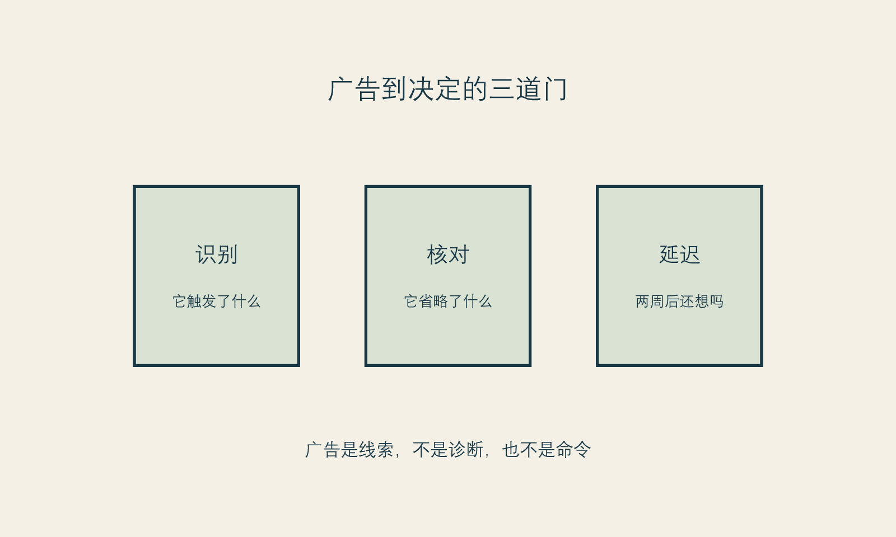

# 广告不是第二个医生

**框架标签：积极斯多葛框架（原创解释框架）**

广告最有效的时候，往往不像广告。它会先替你命名一种不安：疲惫感、松弛感、镜头里的陌生感、同龄人已经变得更好的感觉；再把一条项目路径放进这个不安里，仿佛它本来就在那里。读者看到的不是一句“买”，而是一种更轻的承诺：“只是了解一下”“不做就来不及了”“每个人都在做”。

我不同意把这件事简单归咎于“消费者不够理性”。人在疲惫、被评价、准备进入一个重要场合，或正在经历身体变化时，本来就更容易把外部线索当成内部判断。问题不在于你受到了影响，而在于广告的语言常常借用医学、亲密关系和自我照顾的权威，让“我可以考虑”悄悄变成“我必须尽快解决”。

这就是本章的中心句：**广告可以是信息入口，但不能成为你的第二个医生，更不能成为你的内在法官。**

## 三种越界

第一种越界，是把审美偏好伪装成诊断。一个画面先放大局部，再配上“衰老预警”“问题脸”“修复黄金期”，会让原本多义的外貌差异看起来像明确的缺陷。可“看起来疲惫”不等于一个可以靠某一项目完整解决的医学命题；它可能和光线、表情、睡眠、场景、焦虑或观看方式有关。广告不需要把这些复杂性讲出来，正因如此，它不应独自承担判断的权力。

第二种越界，是把概率语言伪装成结果语言。所谓“自然”“无痕”“一步到位”“人人适合”，给人的感受是确定，而非条件。真正涉及身体的选择，通常有适应证、个体差异、恢复过程、限制与未知项。广告中没有出现这些内容，并不能证明它们不存在；只说明广告的任务不是完整解释。

第三种越界，是把时间压力伪装成关心。倒计时、名额、节日、婚礼、毕业、镜头、年龄节点，都可能是现实场景；但它们也最容易让你用“赶紧成为更好版本”来替代“我到底要解决什么”。当一项身体相关选择只能在紧迫感中成立，它就值得先被放进暂停键里。

中国现行《医疗广告管理办法》规定，医疗机构发布医疗广告前应申请医疗广告审查，未取得证明不得发布。[事实 F-002；@samr-medical-advertising-2006] 国家市场监管总局发布的《医疗美容广告执法指南》则以规范医疗美容广告监管、保护消费者合法权益为目的。[事实 F-003；@samr-aesthetic-ad-guide-2021] 这些规则不能替读者完成个案判断，也不是本书提供法律意见的依据；它们至少提醒我们：医疗美容广告不是普通的生活方式种草，它处在更高的公共风险边界上。

{#fig-advertising-gates}

*图 11 广告到决定的三道门。图为作者原创的消费者判断工具。*

## 把一条广告拆成三层

读到强烈心动的内容时，不必训练自己立刻反感。先把它拆成三层，情绪就不必直接变成订单。

**第一层：它在展示什么？** 这包括画面、前后对比、人物气质、叙事场景和被放大的局部。展示可以令人向往，但展示不是完整事实。它要回答的是“你想看什么”，不是“你需要什么”。

**第二层：它在承诺什么？** 试着把模糊词翻译出来。“高级感”具体指什么？“改善状态”可否描述？“可复制”是对谁、在什么条件下？如果一个承诺无法被复述为可提问的句子，它也就无法被认真核对。

**第三层：它省略了什么？** 省略的不是广告必须承担的全部医学细节，而是你在作决定前需要补齐的问题：适合与不适合的条件、效果的范围、恢复安排、总成本、替代路径、沟通与复核的机制。把“省略”写出来，会让广告从一个封闭故事重新变成未完成的信息。

一个小练习：保存那条最打动你的内容，在下面写两列。

| 它让我立刻相信什么 | 我还需要问什么 |
| --- | --- |
| “我现在的状态很糟” | 哪个具体场景让我这样感觉？是否每个场景都如此？ |
| “这就是我需要的方案” | 它要解决什么，又明确不能解决什么？ |
| “现在不做会错过” | 错过的是医学窗口、价格窗口，还是情绪窗口？ |
| “别人会更认可我” | 我希望获得的认可，是否只有这一条路径？ |

这不是为了证明广告在欺骗你，而是为了把你的判断从广告的节奏里取回来。

## 不把“真实分享”当作完整证据

人们常常更信任“素人分享”，因为它有细节、有情绪、有成本、有恢复日记，也更像一个普通人说给另一个普通人听。但真实性和完整性不是同一件事。一个人真实地喜欢自己的结果，并不能说明同样的选择对你适合；一个人真实地后悔，也不能自动说明所有类似选择都会后悔。

更需要谨慎的是，分享者往往只呈现了自己能够呈现的部分。镜头会裁切时间，平台会奖励强烈转折，叙事会自然选择一个能讲出来的原因。你没有必要怀疑每一位分享者；你只需拒绝把任何一个故事升级为自己的证据等级。

本书建议把内容来源按用途分开：

- 广告和分享，用来发现你在意的议题；
- 合格专业人员的沟通，用来理解个体化的医学问题；
- 规则、研究与可追溯资料，用来核对一般性事实；
- 你自己的记录，用来辨认价值、压力和可承受的代价。

这四类信息不能互相取代。尤其不能让第一类直接替代第二、三、四类。

## 一个不被营销节奏带走的流程

当广告把你推向“现在就决定”时，试着只做四步。

**命名。** 写下它击中了你什么：害怕显老、害怕被比较、想在某个事件前更从容，还是终于看到一种自己喜欢的风格。命名不是压制欲望，而是让欲望不必伪装成命令。

**分离。** 把“我喜欢这个效果”与“我现在就应购买这个方案”分开。前一句是偏好，后一句是行动；两者之间还需要信息、时间和边界。

**核对。** 至少找两个不在同一销售链条中的来源，询问同一问题。不是为了找到“绝对正确”的答案，而是为了看见不确定性是否被完整呈现。

**延迟。** 为高承诺选择设置一个不被优惠绑架的冷却期。冷却期不是自我惩罚，也不要求你最后不做；它是让决定从即时唤起回到长期生活的一段空白。

斯多葛主义常被误解成“不要被任何东西影响”。这不现实，也不必要。更可用的理解是：你无法决定别人用什么画面触发你，但可以决定一次触发是否直接获得你的签名。积极斯多葛主义的积极，不在于否认想变美，而在于让你在想变好时仍能保留主动权。

## 当广告触发了更深的不安

有时，一条内容之所以难以放下，并不因为它说得多有道理，而是因为它碰到了一个更深的命题：我是不是正在失去被喜欢的资格？我是不是已经落后？我是不是必须变得更好，才配进入某个关系、职业或年龄阶段？

这类命题不应由营销文案回答。它也不一定需要立刻由项目回答。若外貌相关的念头变得反复、痛苦，明显影响工作、关系或日常生活，最稳妥的做法是向合格的医疗或心理健康专业人员寻求评估与支持，而不是自行依据网络内容给自己下结论。本书不提供诊断或治疗建议。

### 广告后记录卡

下一次保存内容时，给自己五分钟，写下：

1. 我现在最强烈的感受是什么？
2. 这条内容许诺了一个怎样的未来？
3. 它把哪些前提藏起来了？
4. 如果没有优惠和倒计时，我还会在两周后考虑它吗？
5. 我想要的是项目、风格、照料、休息、被看见，还是别的东西？

第五问没有标准答案。它的作用不是把消费冲动驳回，而是防止一个项目替所有未被说出的需要背书。

## 本章的证据边界

本章对广告语言和消费节奏的分析，是作者的框架性判断；它不对任何机构、平台、创作者或具体内容作违法认定。有关中国医疗广告规则的表述仅限所引规范的文本层面，出版前须再次核对其现行有效状态。[事实 F-002；事实 F-003] “三道门”“广告后记录卡”是消费者自我保护工具，不构成法律、医疗或心理治疗建议。[立场 N-002]

下一章讨论一个常被压缩掉的时间段：恢复期。决定不是在付款时结束，而是在身体、日程、期待和关系重新协商的过程中继续发生。
