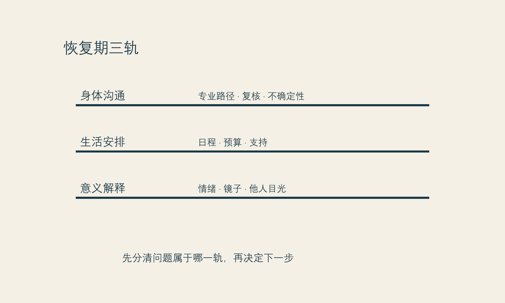

# 恢复期的不确定性

**框架标签：积极斯多葛框架（原创解释框架）**

人们谈论医美，常把时间切成两个点：做之前与做之后。前者是选择，后者是结果。真正困难的部分却在中间。恢复期既不是项目说明书里的空白，也不是“忍一忍就过去”的注脚；它是一段身体感受、日常安排、他人目光、信息摄入和自我解释彼此缠绕的时间。

如果说付款时签下的是一个选择，恢复期里每天都在签的是对这个选择的解释。肿胀、疼痛、等待、镜子里的陌生感、朋友一句无心的话、工作镜头突然变多，都可能把人从“我做了一个经过考虑的决定”拉到“我是不是犯了错”。在这段时间里，最容易发生的不是医学判断，而是心理上的抢答：太早宣布成功，或太早宣布失败。

本章不说明任何项目的恢复规律，也不提供术后处理建议。涉及症状、用药、异常、复查和紧急情况，应遵循治疗团队的具体指示，并在需要时及时联络合格专业人员。这里讨论的是另一件事：怎样不把不确定性误判成道德失败。

## 恢复期为什么放大判断

恢复期会同时降低三种能力。第一是耐心。身体感受占据注意力时，人很难像平时一样处理模糊信息。第二是比例感。局部变化在镜子、自拍和反复查看中会被放大，生活的其他部分却缩小到背景。第三是自我善待。你可能会责备自己太冲动、太虚荣、太不该在意外表，仿佛所有不舒服都是一场应得的惩罚。

积极斯多葛主义不要求你在不舒服时表现得毫无波澜。它要求的只是把问题放回正确的层级：有些事情属于需要专业判断的身体问题；有些事情属于等待与观察；有些事情属于我们在焦虑中赋予它的意义。把三者混在一起，会让任何一个小波动都看起来像人格、命运或关系的判决。

可以使用一个简单的“三栏记录”。

| 发生了什么 | 我知道什么、还不知道什么 | 我现在可以做什么 |
| --- | --- | --- |
| 我照镜子时很慌 | 我知道自己很在意；我不知道这意味着最终结果 | 按专业人员给出的路径核对；减少重复拍摄；找支持者说清楚感受 |
| 别人问我是不是变了 | 我知道对方问了；我不知道对方在评价我 | 选择一个预先准备好的回答，或说我不想讨论 |
| 我后悔付款 | 我知道我在后悔；我不知道这种感受会持续多久 | 记录触发点，不在情绪高峰新增项目或作重大消费决定 |

第三栏并不承诺你马上好受。它只是把“我必须立刻确定一切”改成“我可以完成眼前可完成的一步”。

{#fig-recovery-tracks}

*图 12 恢复期三轨图。图为作者原创，提醒读者不要把不同性质的问题混为一谈。*

## 给恢复期预留生活空间

很多选择在咨询室里显得可行，是因为生活成本尚未进入画面。恢复并非只占用日历上的几天；它也会碰到照护责任、会议、出差、拍照、亲密关系、睡眠、预算、隐私以及你是否能安心休息。提前把这些问题写下来，不是悲观，而是尊重现实。

在决定前，读者可为自己准备一份“恢复期生活表”，不填医学答案，只填生活条件：

- 谁知道这件事，谁不需要知道？
- 我有没有可以减少社交和镜头的时间？
- 若情绪变得脆弱，我想找谁陪伴，谁反而会加重压力？
- 哪些工作和照护责任不能被想当然地取消？
- 总预算是否留出了非项目本身的缓冲？
- 我是否把某个必须出现的日期，当成了自己必须立刻变好的期限？

这份表的价值在于，它让“恢复”从一段抽象的医学术语，重新变成你实际拥有或缺少的条件。若条件暂时不足，推迟可能是成熟的选择，而不是错过机会。

## 不要把镜子变成监测仪

恢复期最常见的陷阱之一，是反复检查。你本来只想看一眼，后来变成不同灯光、不同角度、不同滤镜、不同时间段的无数次比对。每一次检查都像是在寻找一个确定答案；但当答案尚不能被镜子给出时，检查只会让注意力越来越窄。

给镜子设边界，不是要你逃避自己的脸或身体，而是停止把镜子当作即时裁决者。你可以预先决定：在必要的日常照料之外，不在一天内反复自拍，不拿旧照或他人照片做高频比对，不在情绪最强时搜索极端故事。若需要记录，也尽量用固定光线、固定频率、固定目的的方式完成，并以专业沟通的要求为准。

这里的关键不是“少看就会满意”。那是一种不能保证的心理承诺。关键是，少一些重复检查，能够为生活中其他可控的事腾出注意力：吃饭、睡觉、工作、走路、读书、和可信的人说话。生活恢复得越早，外貌越不容易独占你的解释权。

## 他人的目光不是恢复指标

一些读者真正害怕的不是变化本身，而是别人会怎样看。担心被发现、被议论、被说不自然，也担心没有人注意到，仿佛投入因此失去证明。两种担心背后都有一个共同结构：把他人的反应当成结果的唯一计量器。

这很苛刻。别人可能看见，也可能没看见；可能称赞，也可能沉默；他们的反应常由自己的注意力、关系边界和表达习惯决定。它们不构成对你价值的裁定，也不构成对医疗结果的专业评价。

提前准备边界语言，能减少临场的慌乱：

- “谢谢关心，我现在不想展开聊这个。”
- “我在照顾自己的状态，具体细节我想保留。”
- “我更希望我们谈今天这件事。”
- “如果我需要建议，会主动来问你。”

这些话并不冷漠。它们是在把关于你身体的信息所有权留在你手里。关系中真正支持你的人，未必总能说出完美的话，但会尊重你不说明的权利。

## 后悔出现时，先不要把它浪漫化或妖魔化

后悔是恢复期里很容易被道德化的感受。有人把后悔当成“我终于清醒”，有人把它当成“我果然不配做决定”。这两种解释都太快。后悔可能来自疼痛、预算压力、等待、期待落差、他人反应，或某个原本就存在的生活难题被重新照亮。它也可能持续很久，值得被认真对待。

更稳妥的处理是先区分：现在是需要医疗沟通的问题，还是需要生活支持的问题，还是需要更长时间观察的感受问题。对前者，应联系合格专业人员；对第二类，可能需要调整日程、预算、隐私与陪伴；对第三类，可以先避免在情绪高峰加码选择。任何一种都不需要靠自责来证明你有判断力。

2025年的一项系统综述指出，关于美容手术后心理社会结局的证据整体仍受研究质量和长期数据限制；部分短期结果可能改善，但不能据此对任何个人作确定预测。[事实 F-009；@garbett-2025] 这不是为了制造恐惧，而是为了拒绝两种过度承诺：做了就一定更快乐，或一时不安就一定说明做错了。

## 把恢复期看成一次练习

斯多葛传统里有一个朴素的分辨：不是所有发生在我身上的事都由我决定，但我仍能练习如何回应。放在恢复期，它不是让人硬撑，而是把注意力放回可负责的环节：遵循合格专业人员的沟通路径、维护自己的生活安排、减少不必要的比较、说清自己的边界、在需要支持时求助。

这份练习还有更积极的一面。它让你发现，你对自己的照料不必等到结果满意才开始。你可以在不确定中按时吃饭、允许休息、拒绝不想参加的活动、把镜头关掉、向可信的人说“我今天有点脆弱”。这些行动不能决定最终外观，却能决定你是否被一段恢复期完全吞没。

### 恢复期备忘卡

把下面几句话写在容易看见的地方：

> 我可以关心结果，但不必每小时裁判结果。  
> 我可以感到后悔，但不必立刻把后悔变成下一次决定。  
> 我可以需要帮助，而不必先证明自己足够严重。  
> 我不必用别人的反应，为自己的选择盖章。

这些不是积极暗示，更不是对专业意见的替代。它们只是把你从仓促的自我审判中带回一个可呼吸的位置。

## 本章的证据边界

“恢复期三轨图”“生活表”和“备忘卡”均为作者原创的生活与决策工具，不包含项目恢复时长、风险处置、用药或医疗判断。有关美容手术心理社会结局的概述来自系统综述，但研究结果不能外推为个人预后。[事实 F-009] 如出现任何医疗或心理健康方面的担忧，应联系相应的合格专业人员。

下一章谈满意。满意不是一个在结果出现时自动亮起的灯，也不应成为你被允许继续生活的条件。
