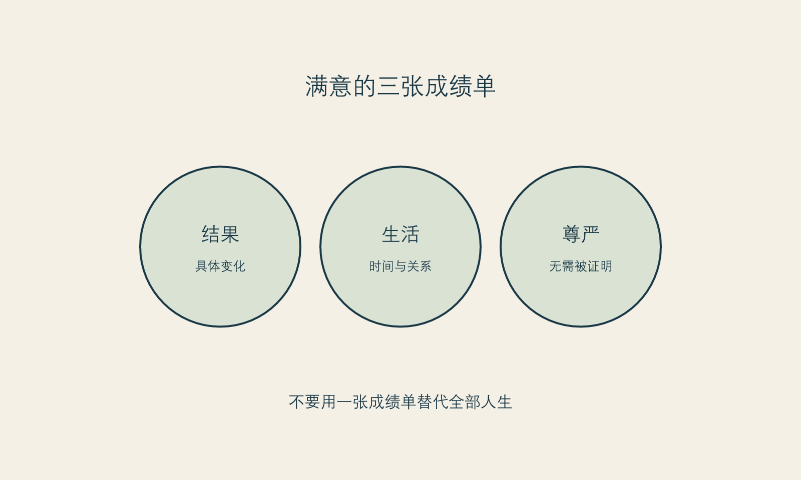

# 满意不是一个按钮

**框架标签：积极斯多葛框架（原创解释框架）**

“满意了吗？”这句话听起来像一个简单问题，却把许多复杂体验压成了一个开关。好像结果一旦出现，人就该回答满意或不满意；满意意味着选择正确，不满意意味着需要立刻修正。对以外貌为中心的消费来说，这种二分法特别危险，因为它会把人的感受、关系、期待、身体变化与下一次购买，绑成一条过快的链。

我不同意把满意当作“项目是否值得”的唯一指标。满意当然重要，但它不是单一、稳定、只由一个结果决定的心理状态。你可能喜欢某一处的变化，却仍对另一处感到焦虑；你可能在某个场景很自在，在另一个场景又开始比较；你可能认可自己当时的决定，却不喜欢恢复过程中的某一天。允许这些并存，比强迫自己给出一个总评分更诚实。

本章提出一个更有用的区分：**结果评价、生活评价与自我评价，不是同一件事。**

## 三张不同的成绩单

结果评价问的是：我所期待的具体变化，在我理解的范围里是否出现？这是一个可以与合格专业人员继续沟通的问题，但它往往需要条件、时间和专业解释。

生活评价问的是：这段选择进入我的日程、预算、关系和注意力后，给我的生活带来了什么？它不必只看外貌，也要看你是否更能工作、休息、社交，还是反而被反复检查、隐瞒、比较和追加消费占住。

自我评价问的是：我是否因此更值得被尊重、更配拥有关系、更有资格被看见？这张成绩单本来就不该由医美、衣着、体重、护肤或任何改善型消费来出具。它是最容易被偷偷塞进消费决定、也最需要被请出去的一张。

{#fig-satisfaction-ledgers}

*图 13 满意的三张成绩单。图为作者原创，帮助避免把身体选择升级为人格判决。*

当三张成绩单混在一起，人很容易走向两种极端。第一种是“既然还有不满意，我就必须继续做”。第二种是“既然我在意外貌，我就是肤浅的”。前者把正常的复杂感受变成加码理由，后者把偏好变成罪证。两者都没能给你真正的判断空间。

## “下一项就好了”的危险

改善型消费有一种天然的递进结构：发现一个部位，解决一个部位；看到新的对比，再发现新的部位。这个过程不必然错误，但它很容易让人把“还有想改善的地方”理解成“我刚才的选择完全失败”。于是，满意不是被体验，而是不断被推迟到下一项之后。

为此，给自己设一个“解释窗口”很重要。它不是医学上的固定时间，也不是所有人都适用的规则，而是一个行为边界：在尚未完成与专业人员约定的沟通、观察或复核之前，不因焦虑、平台内容或他人评价而追加新的高承诺决定。你可以记录新念头，但不必马上把它们转成行动。

记录时问三个问题：

1. 我想追加的，是一个新的具体问题，还是想消除“我还不够好”的感觉？
2. 这个念头在什么场景出现得最强？镜头、争吵、疲惫、比较、促销，还是安静独处？
3. 如果我先不做任何新选择，一个月后我希望生活中哪一件事先变得更稳？

第三问有意把注意力从脸上移开。它不是否认外貌问题，而是防止外貌成为唯一的解释出口。

## 当“看起来有问题”占据太多生活

本书不能也不会教读者给自己诊断。需要说清的是：如果对外貌缺陷的担心变得反复、难以控制，伴随大量检查、回避、比较或明显影响工作、关系和日常生活，那么“再找一个项目”不应是唯一入口。向合格的医疗或心理健康专业人员寻求评估与支持，可能比在信息流里继续寻找答案更稳妥。

一项2022年的系统综述与荟萃分析，汇总了美容手术请求者相关的48篇文章、14,913名参与者，估计身体变形障碍的患病率为19.2%，并报告研究间存在明显异质性。[事实 F-007；@salari-2022] 这个数字不能用来判断任何一个人，更不能用来给某机构人群贴标签；它只提示一个边界：在求美场景中，不能把所有强烈困扰都当成“审美要求高”。

关于整形外科场景筛查方法的系统综述也指出，相关工具的验证证据有限，仍需要进一步研究。[事实 F-008；@houschyar-2019] 因此，本书不附自测题、不把网络筛查当作诊断，也不建议读者拿任何量表为自己或他人下结论。真正有帮助的第一步，往往是把困扰说给具备相应资质的人听。

## 把结果从“救赎任务”里松开

当一项选择被赋予太多任务时，结果很难承受。你希望它让你在婚礼上自在、在职场上更有底气、在关系里更安全、在年龄焦虑里更平静、在过去的伤害里翻页。这里面有些期待是可以讨论的，有些却属于关系、创伤、职业处境或自我价值的更深层工作。一个项目可能参与其中，但不应被要求独自解决所有问题。

积极斯多葛主义在此给出的不是“降低期待”的训诫，而是一个分配原则：把一项改变可以承担的责任，和你的人生需要被照料的责任分开。前者可以被精确询问、评估和沟通；后者需要更长的生活建设，有时也需要支持系统。把它们分开，不会让愿望变小，反而使愿望不必背负不可能完成的职责。

你可以写下这样一段“责任分配”声明：

> 我希望这项选择帮我改善____。  
> 我不要求它证明我____。  
> 即使结果有局限，我仍会通过____照料自己在意的生活部分。  
> 若我发现自己把全部希望压在它身上，我会先暂停下一步，并找____讨论。

声明不保证满意，但能让你看见自己是否正在把一个有限选择扩大为全人生的判决。

## 允许喜欢，但不以喜欢为债

有些人担心，若自己没有表现出足够满意，就等于辜负了花费、家人的支持或专业人员的努力。于是他们强迫自己说“挺好的”，压下所有疑问；另一些人则因为不敢承认喜欢，怕显得虚荣，便把任何愉悦都解释成浅薄。两种克制都让感受失去真实位置。

你可以喜欢变化。你也可以有疑问。你可以愿意继续沟通，而不必先把自己归入“完美受益者”或“失败消费者”。这不是矫情，而是对身体相关选择应有的复杂度。

2025年的系统综述认为，美容手术后心理社会结局的总体证据仍不足以支持简单的“会更幸福”叙事，且长期结局不确定。[事实 F-009；@garbett-2025] 这项结论的价值不是泼冷水，而是让我们避免把满意许诺成商品。满意可以发生，也可以变化；它不应成为任何人被尊重的前提。

## 从评价回到照料

如果你发现自己每天都在给结果打分，试着把问题从“我满意吗”换成更具体的三个问题：

- 我今天是否做了一件支持生活稳定的事？
- 我今天是否把自己暴露在不必要的比较里？
- 我今天是否允许一个感受存在，而不立刻把它变成购买、否定或证明？

这些问题听起来小，却把“满意”从一枚遥远的奖章，拉回可练习的日常。你不必把身体选择从人生里删除；你只需要阻止它接管整个人生。

## 本章的证据边界

本章不把身体变形障碍患病率研究用于个人筛查、诊断或风险预测。[事实 F-007；事实 F-008] 关于美容手术心理社会结局的讨论，受不同项目、样本与研究设计限制，不能外推为个体结果。[事实 F-009] “三张成绩单”“解释窗口”和“责任分配声明”是作者的非临床决策工具。若外貌困扰造成显著痛苦或功能受损，请寻求合格专业帮助。

下一章离开面诊室和镜子，讨论一个反直觉的命题：改善并不必须只发生在脸上，很多时候，它更需要发生在生活的支撑结构里。
