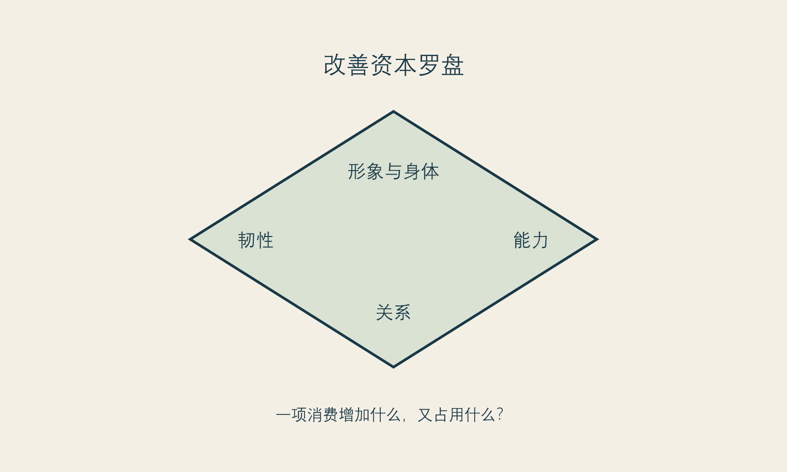

# 把改善从脸上拿下来

**框架标签：积极斯多葛框架（原创解释框架）**

“改善自己”很容易被理解成改善外貌，因为外貌最容易被看见、被比较、被量化，也最容易被市场拆成一个接一个的项目。但如果一个人的改善只能发生在镜子里，那么她很快会发现：镜子永远有新的角度，平台永远有新的标准，消费永远有新的下一项。

我不同意把“把改善从脸上拿下来”理解成反对外貌改善。那会重演另一种道德优越感：仿佛关心外貌的人不够深刻。这个命题真正反对的是单通道改善，即把精力、金钱、时间和希望几乎全部押在可见外观上，仿佛生活中所有的不满足都能在那里被修复。

积极斯多葛主义提供的不是少欲望，而是**多支点**。当一个人的尊严、愉悦和行动能力只靠一个支点支撑，它就特别容易被风吹倒；支点多一点，外貌仍可以重要，却不必成为唯一的生命工程。

## 四种改善资本

为了让“多支点”不只是一句好听的话，本书把改善型生活消费粗略分成四种资本。它们互相影响，但不互相替代。

| 资本 | 它回答的问题 | 容易被忽略的风险 |
| --- | --- | --- |
| 身体与形象资本 | 我如何感到舒服、得体、可见？ | 把形象误当成人格价值 |
| 能力资本 | 我能做什么、学什么、如何保持选择余地？ | 只为证明自己而不停升级 |
| 关系资本 | 谁能理解我、支持我、与我共同生活？ | 用被看见替代被理解 |
| 生活韧性资本 | 我有多少睡眠、时间、财务缓冲与恢复能力？ | 把透支伪装成自律 |

一个项目可能提升其中的一部分，也可能占用另一部分。比如，一项外貌选择可能让你在某个场景更从容，但若它把预算压缩到没有休息、学习或照护的余地，它就不再只是“变好”，而是资本之间的取舍。成熟的判断不在于永远选择非外貌的那一项，而在于看清你是在增加生活的承载力，还是在用一个可见变化掩盖承载力的不足。

{#fig-improvement-capital}

*图 14 改善资本罗盘。图为作者原创，用于判断一项消费增加或消耗了哪些生活资源。*

## 当外貌成了唯一解释

有一个值得警觉的信号：当你开始用同一个外貌问题解释太多生活困难。工作不顺，是因为我看起来不够好；关系紧张，是因为我不够有吸引力；不敢表达，是因为我某处不够完美；没有休息，是因为我还不配松下来。这样解释的好处是简单，坏处是把真正需要处理的处境全部压缩成一张脸。

外貌当然会影响体验，也确实处在社会评价之中。否认这一点并不诚实。但它不是全部原因。社会比较与身体不满意之间有稳定的关联证据，说明比较环境值得被认真对待；它并不说明每一种不安都要由外貌本身解决。[事实 F-005；@bonfanti-2025] 当问题被错误地缩小，解决方案往往会被错误地放大。

一种实用的反问是：**如果这个外貌问题明天暂时不再困扰我，我的生活中还会剩下哪些困难？**

答案可能是睡眠不足、收入焦虑、职业门槛、亲密关系里的不安全、长期疲惫、缺少朋友、缺少空间、被照护责任压住。它们并不比外貌问题“更高级”，只是更接近你真正要照料的生活。把它们写出来，不是为了取消医美选择，而是避免让一个选择替所有问题承担责任。

## 给预算一个价值次序

消费建议常说“量力而行”，但这句话太空。更具体的做法是把预算放进三个账户：安全账户、生活账户、愿望账户。

- 安全账户包含基本生活、必要医疗、债务与缓冲；它不该被“难得的机会”随意挪用。
- 生活账户包含休息、学习、照料、关系与让日常可持续的开销；它决定你是否有能力承受选择之后的生活。
- 愿望账户才是可以用于改善型消费的部分；它可以被认真使用，却不应吞掉前两者。

这不是一套普遍适用的财务比例，也不是对任何人消费能力的评判。它只是在提醒：一个让你失去安全和生活余地的选择，即使看起来“很值得”，也应当被重新计算。

斯多葛人的节制并不等于拒绝好东西。它是拒绝把好东西变成主人。对改善型消费而言，节制的现代形式或许是：我可以为喜好花钱，但不让一项喜好夺走我保持选择余地的能力。

## 一个每周的改善盘点

每周花十分钟，给四种资本各写一件你实际做过的事，不要求它们都要花钱。

| 本周我为自己增加了什么 | 例子 |
| --- | --- |
| 形象与身体 | 穿了舒适的衣服、完成了必要照料、停止跟拍比较 |
| 能力 | 学会一个技能、完成一个工作步骤、整理一份资料 |
| 关系 | 主动联络一个可信的人、说清一个边界、接受一次帮助 |
| 韧性 | 早睡一次、留下预算缓冲、取消一项不必要的消耗 |

这个盘点不会制造立竿见影的自信。它做的事更朴素：让你每天都能在不靠外貌评分的地方，找到自己正在变好的证据。

## 不是替代，而是重排

当读者开始在能力、关系、休息和形象之间重排优先级，常会担心这是否意味着“我不该再做医美”。不一定。有人会发现自己仍想做，只是愿意多等一等、少做一点、换一种方式沟通；有人会发现真正需要的是暂时离开比较环境；也有人会发现外貌选择依然在其价值排序里。框架不替你作出结论。

它只要求一个诚实条件：任何选择都应当经得起“它给我的生活增加了什么，也拿走了什么”的追问。能通过这句话的改善，更不容易让人自困。

## 本章的证据边界

“四种改善资本”“三账户”和“每周盘点”是本书的价值与消费工具，不是标准化心理测验或财务建议。[立场 N-001] 社会比较研究提供的是关联层面的背景，不证明任何个人的外貌困扰由单一因素造成，也不保证减少比较即可解决困扰。[事实 F-005]

下一章转向关系。许多消费决定并不是在一个人独处时形成的，而是在评价、期待、建议、玩笑和沉默之间慢慢被推着走。
