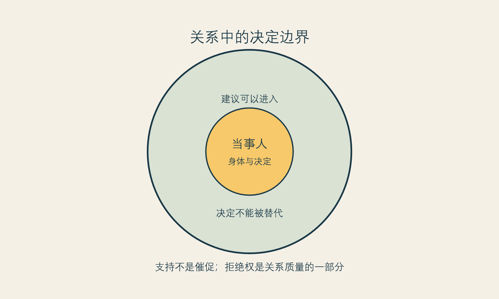

# 关系中的拒绝权

**框架标签：积极斯多葛框架（原创解释框架）**

很少有外貌决定是完全独自形成的。有人被伴侣的一句评价刺痛，有人想在家人面前显得更有精神，有人担心职场镜头，有人被朋友的“你也去做一下吧”推动，也有人把改善当作重新进入社交的门票。关系并不一定恶意，甚至许多建议来自关心。但关心一旦跳过了你的意愿、身体和承受能力，就会从支持变成压力。

本章的立场很明确：**任何涉及身体的改善，都需要保留拒绝权；而关系的质量，恰恰体现在它能否容纳这份拒绝。**

拒绝权不只意味着对一个项目说不。它还包括对讨论说不、对评价说不、对催促说不、对被拍摄说不、对被当成案例说不。一个人可以愿意分享，也可以改变主意；可以接受建议，也可以不接受；可以喜欢外貌改变，也可以拒绝让外貌成为关系中的常设议题。

## 建议、评价与命令

关系里的语言常混在一起。有人说“我只是建议”，实际上传递的是“你应该照我的标准改变”；有人说“我是为你好”，实际是把自己的焦虑交给你处理；有人说“开个玩笑”，却在重复标记你的身体。区分它们，不是为了把每一次笨拙表达都升级为伤害，而是为了知道你面对的是什么。

- **建议**会提供理由，也允许你不同意。
- **评价**表达个人感受，但不必然要求你行动。
- **命令**把不同意的成本抬高：冷淡、羞辱、嘲讽、威胁、撤回支持或把你说成不爱自己。

当一条“建议”让你害怕拒绝、害怕失去关系、害怕被嘲笑，它就已经超出了建议的范围。你不需要先证明自己受伤得足够严重，才有资格设边界。

{#fig-relational-boundaries}

*图 15 关系中的决定边界。图为作者原创。*

## 四句边界语言

边界不是辩论冠军的发言稿。它的目标不是让每个人都承认你对，而是让你不必持续暴露在一个不想继续的议题里。以下句子可以按关系和语气调整：

1. “我知道你有想法，但这件事我会自己评估，不需要现在做决定。”
2. “我的外貌不是我们今天要讨论的主题，请不要继续评论。”
3. “如果你担心我的状态，可以问我需要什么支持，而不是替我指定怎么变。”
4. “我听到了，但我不接受用比较、玩笑或威胁来推动我。”

说出边界以后，对方不一定马上理解。边界的有效性不取决于对方是否满意，而取决于你是否把下一步行动配套起来：离开话题、减少解释、改变见面场景、寻求支持，必要时重新评估关系中的安全感。若关系中出现控制、威胁、经济限制、强迫身体改变或其他让你感到不安全的情形，优先考虑现实安全与可获得的专业支持。

## 不把反对自动理解成羞辱

另一方面，关系中的拒绝权也要求我们允许他人不为我们的选择背书。伴侣、家人或朋友可以担心预算、恢复安排、风险、照护责任或情绪状态；这不必然等于他们否认你的身体主权。真正的分界不在于“对方是否赞成”，而在于他们是否尊重你有时间、信息和退出权，是否愿意把担心说成可以讨论的事实，而不是攻击你的人格。

一种可用的对话结构是：

> 我现在考虑的是____。  
> 我希望它改善的是____。  
> 我知道其中有____需要谨慎。  
> 我希望你提供的是____，而不是替我作决定。  
> 如果你有担心，请说具体条件，不要评价我的价值或外貌。

这样的表达不保证谈话顺利，却让双方有机会从“你支持不支持我”转向“我们能否尊重彼此的担心与决定边界”。

## 让支持者承担正确的角色

支持者不是第二个销售，也不是第二个审判者。最有用的支持往往很朴素：陪你把问题写出来，提醒你不要在压力下付款，帮助安排日常，尊重你不想解释的部分，在你情绪反复时仍不把你变成谈资。

若你准备让某人参与面诊或恢复安排，可在事前明确其角色。比如：“我希望你帮我记下信息，不要替我回答”；“如果我被优惠催促，请提醒我带资料回家”；“我不希望你把我的决定告诉任何人”。角色越具体，关心越不容易越界。

斯多葛传统重视人与人之间的义务，但这并不意味着个人必须服从关系中的评价。相反，真正的关系义务包括不把他人当成满足自己焦虑、审美或控制欲的工具。对身体相关决定而言，这是一条尤其重要的尊严边界。

## 本章的证据边界

本章是关系沟通与价值判断，不对任何关系下法律、医疗或心理风险作个案判断。[立场 N-002] 其中的边界语言可按现实安全、依赖程度与文化环境调整；在感到不安全时，不应仅依靠沟通模板，应优先联系可信支持者或相应专业机构。

下一章谈“有限”。它不是消极的退场，而是让任何改善都不再要求你无限投入、无限等待、无限证明自己的起点。
